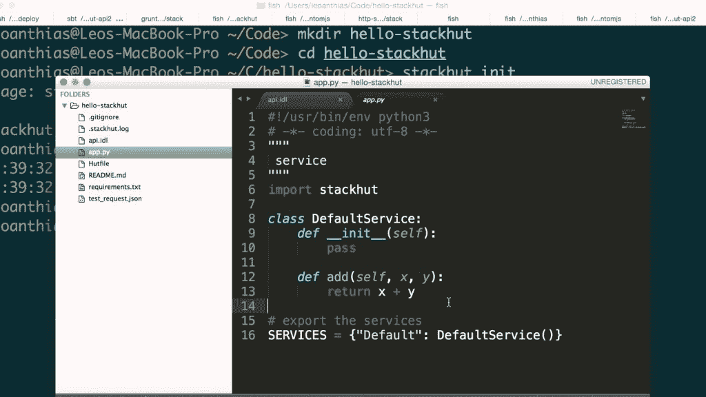
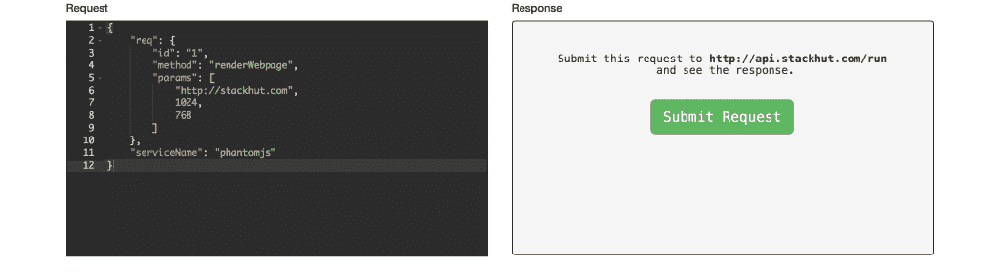
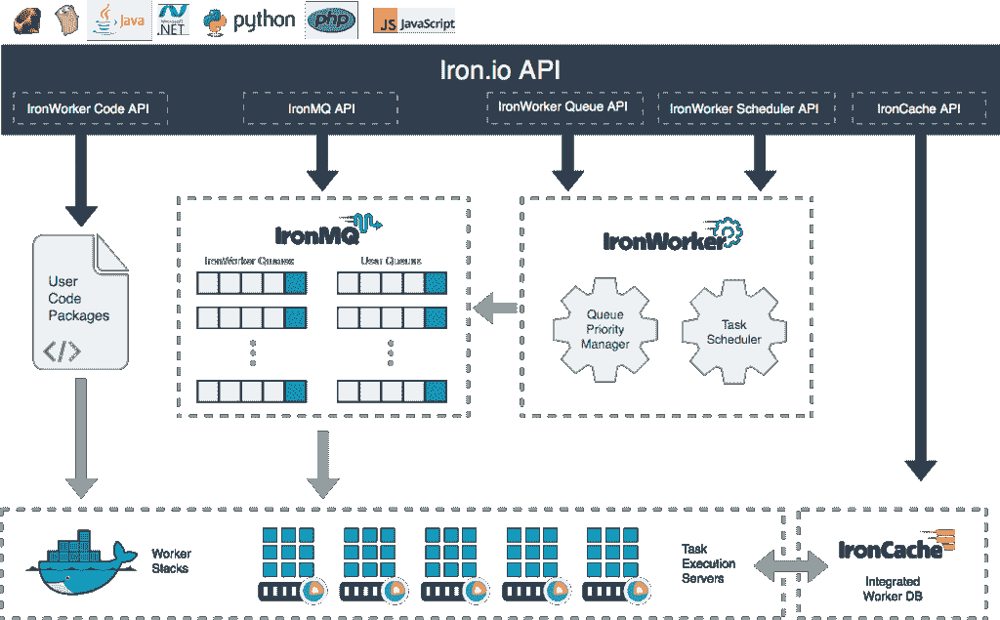
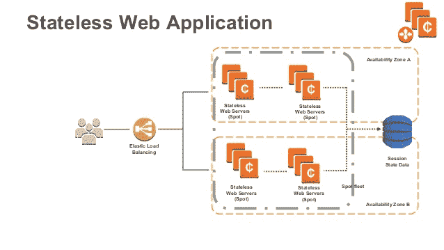
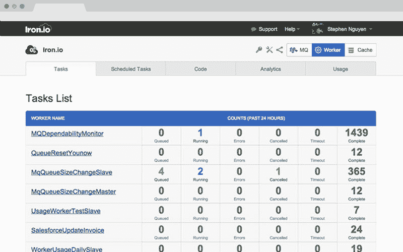

# 未来的一年:无状态计算的承诺

> 原文：<https://thenewstack.io/year-ahead-stateless-computing/>

*在本周的 New Stack，在名为“未来一年”的系列中，我们将探讨一些技术和技术问题，我们预测这些技术和技术问题将在 2016 年对我们的读者非常重要。无状态计算是我们计划在 2016 年密切关注的一个领域。*

当纽约连续创业家丹尼尔·伊尔科维奇想要开始一项新业务，一项允许企业轻松创建自己的业务流程的业务时，[他将他的技术基于亚马逊网络服务的 Lambda 服务](http://www.cmswire.com/information-management/let-dexter-do-the-dirty-work/)。由此产生的服务被称为 [Dexter](https://rundexter.com/) ，它提供了一种通过将来自不同 API 的服务链接在一起来构建简单应用程序的方法。

有前途的新技术的一个标志是它如何打开更多功能的大门，甚至是新的商业模式。Lambda 是一年前推出的一种无状态计算 AWS，当然符合这里的标准。

通过抽象出运行应用程序所需的所有操作和开发基础设施(从服务器到存储), Lambda 服务使 Ilkovich 和他的客户的事情变得简单。这就是 Lambda 被称为“无状态”服务的原因。Lambda 运行一个用户定义的函数，从外部服务收集数据，以某种方式处理数据，并将输出传递给其他服务。

该代码必须由外部事件触发，例如来自移动应用程序、web 服务或另一个 AWS 服务的来电。亚马逊 S3 桶或 DynamoDB 表中的变化可以触发函数调用。

“你只需要把工作交给 Lambda，它就会替你做计算，”AWS Lambda 总经理蒂姆·瓦格纳(Tim Wagner)在 10 月份该公司的 [re:Invent](https://reinvent.awsevents.com/) 会议的分组会议上说。"所以不会出现服务器太多或太少的问题."

AWS 在 Lambda 上下了大赌注，毫不奇怪，其他公司正在开发或已经在运行类似的服务。例如，微软通过 Azure 事件中心提供类似的功能。

“如果你谈论 Lambda 包含的所有东西——轻量级任务执行、通知、高速消息传递——Event Hub 做到了所有这些，”微软 Azure 的首席技术官 Mark Russinovich 说。其他公司，如 [Iron.io](https://www.iron.io/) 和 [StackHut](https://stackhut.com/#/) ，也提供自己的服务。我们预计 2016 年你会听到更多关于他们的消息。

## 无状态与服务器

使用无状态计算的最大好处是能够将项目分成可管理的部分。对于拥有跨多个数据中心的数据的企业级组织，无状态计算不仅在访问数据方面，而且在操纵和操作数据方面都有显著的改进。

“无状态计算从根本上改变了开发人员和操作人员对正在构建的软件的看法。Iron.io 首席执行官 Chad Arimura 表示:“他们不会考虑大型整体应用程序，而是考虑容易理解的工作。”当使用微服务(提供应用程序的片段)时，团队可以快速查看失败的任务并采取行动，或将特定的工作负载分配给一系列团队，而不是花费大量时间来维护整体应用程序。

无状态计算的一个主要优势是 Lambda 和它的替代品关注的平台的一个关键点:易用性。不仅无状态计算可以轻松扩展，运行 Lambda 函数的容器或在 Docker 容器中执行的任务可以基于可用的空闲系统容量重启或启动。无状态计算使任务能够大规模运行，而不需要配置延迟，这在跨虚拟机调配的传统基于服务器的体系结构中经常出现。

用 StackHut 编写基于 Python 的 API 代码

OracleLinux 和虚拟化工程高级副总裁 Wim Coekaerts 表示:“现在的趋势是将更多的应用程序放入容器中，而不是虚拟机，部分原因是在降低开销、磁盘空间和效率方面有一些额外的优势，但也是因为启动速度，因为这些服务可以立即启动您的应用程序，而在虚拟机中，您通常仍然需要经历一个正常的启动过程。”。

随着自动化越来越成为开发过程的一部分，无状态计算平台允许开发人员将他们的重点从管理服务器的部署、存储空间的分配和复杂的扩展问题转移到创建他们的产品。随着企业运行的应用程序每天处理成千上万的用户请求，无状态计算已经成为大规模运营的一项要求，并且无疑将继续如此。

使用 StackHut 部署代码

无状态技术的另一个特征是抽象是如何根据组织希望完成的事情发挥作用的。当运行无状态服务时，抽象配置和设置允许应用程序部署的灵活性，而没有传统的障碍，例如维护服务器或配置虚拟机。

对于许多组织来说，Lambda 并不适合他们当前的基础设施。因此，无状态计算的未来已经在允许不可知论的服务提供商中出现，这使开发人员有机会在他们的堆栈中运行的任何操作系统和云上利用无状态计算的优势。

内存计算软件提供商 [ScaleOut Software](http://www.scaleoutsoftware.com/) 的首席执行官兼创始人比尔·贝恩表示:“为了让无状态计算发挥其潜力，应用程序需要能够可扩展地快速访问资源。”。Lambda 也不能满足今天监控应用程序依赖性的需求。相比之下，许多容器平台和监控服务现在为开发人员提供了这样的能力:如果应用程序依赖项需要更新，或者在构建容器时失败，就触发发送给他们团队的警报。

在隐私至关重要的公司中，AWS Lambda 的替代品已经表明，它们为潜在客户提供了显著的好处。Iron.io 和 [StackHut](https://stackhut.com/) 都可以运行在公共、混合和私有云平台上。虽然 AWS Lambda 目前还不允许这种程度的灵活性，但亚马逊有望在 2016 年实现这一点。

## 无状态计算的未来

对客户使用无状态技术的平台不仅服务的采用显著增加，而且技术的用例也显著增加。特别是，跨多个数据中心处理批量数据的大型组织会发现无状态计算对他们特别有用。随着越来越多的公司根据其连接的设备、互联网浏览历史和内部指标从客户那里收集数据，开发人员可以编写代码，使用收集的信息来触发 Lambda 函数。

铁。Io 平台架构

配置这些功能通常需要大量代码来确保流程正确运行。这导致花费在新项目编程上的时间减少，开发人员的大部分工作日都被配置或维护服务器依赖性所占用。

无状态计算为开发人员提供了灵活性，不仅可以自动化该工作流并将其从物理服务器设置中抽象出来，还可以配置操作系统、声明依赖关系、在任何容器或云平台上运行等等。当事件触发时调用服务可以通过这些未来平台中的前端或后端代码来处理，这在混合环境中或通过私有云开发时提供了另一层弹性。

“为了使这更容易，我们包括了 JS/ES6 和 Python 的客户端代理库，以及标准的 HTTP 加 JSON 后备。这使得将 StackHut 服务整合到公司现有系统和代码库变得简单，”StackHut 的联合创始人 Leo Anthias 说。

AWS 无状态 Web 应用程序

在 Iron.io 的例子中，Arimura 指出，使用该平台的开发人员将编写小的包含在 Docker 容器中的作业。Iron.io 在 2015 年推出了超过 10 亿个 Docker 容器，是 2014 年推出量的 10 倍。2016 年，随着越来越多的公司在自己的基础设施中采用无状态计算，这一数字肯定会增加。

“我们允许用户编写他们基于服务器的业务逻辑，消除了配置服务器、操作系统、应用编程接口等所需的繁琐样板文件。我们将这些代码与我们的定制运行时一起打包到一个 Linux 容器中，我们可以根据请求按需启动它。

Iron.io 中的任务仪表板

尽管前景光明，但有些人会发现他们的工作量不适合无状态方法。“并不是每个应用程序都非常适合这种模式，所以可能需要一些时间来理清哪些可以或将要转移到更无状态的模式。无状态计算非常适合云部署，因为它们在设计上是动态的，并且您可以获得一个基于需求的横向扩展模型，非常适合计量环境，”Coekaerts 说。

容器仍然是大规模管理和部署应用程序的稳定、一致的方式。无状态计算是 Docker、Kubernetes 和 Amazon EC2 等容器平台不断发展的自然延伸。随着无状态技术在各种云提供商(公共云、混合云和私有云)中的广泛应用，其采用率将会继续提高。这无疑将塑造软件开发的未来，因为它允许开发人员精心设计一种新的、灵活的方法来开发微服务并在其堆栈中使用容器。

《新书库》执行主编 Joab Jackson 为本文做出了贡献。

Docker 是新堆栈的赞助商。

在[知识共享协议 CC0](http://creativecommons.org/publicdomain/zero/1.0/deed.en) 许可下的特征图像“数据中心”。

<svg xmlns:xlink="http://www.w3.org/1999/xlink" viewBox="0 0 68 31" version="1.1"><title>Group</title> <desc>Created with Sketch.</desc></svg>