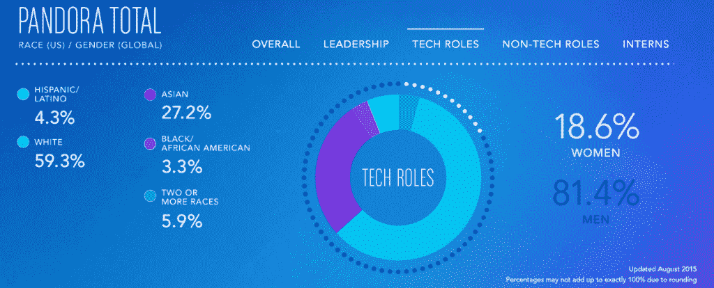
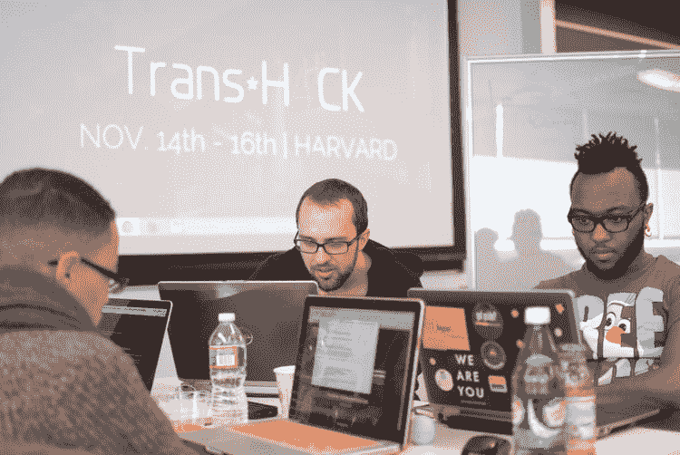
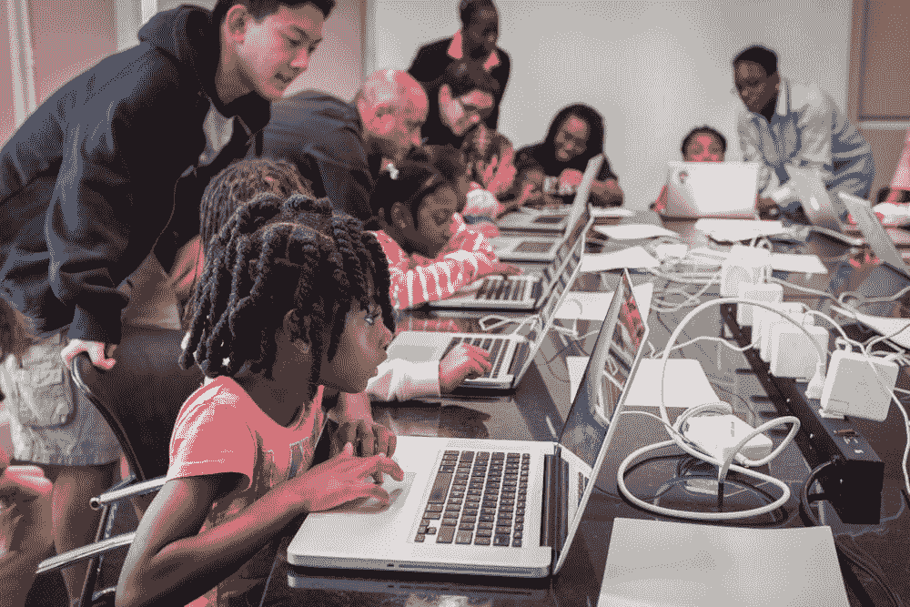

# 未来一年:2016 年将是 IT 多元化之年吗？(回答:没有，但是事情正在发生)

> 原文：<https://thenewstack.io/year-ahead-will-2016-year-diversity-answer-no-things-happening/>

2015 年将因容器平台的崛起而被铭记，它将成为软件开发、微服务和无状态计算的新标准。这一年也将被铭记，因为技术行业开始注意到许多仍然影响多样性的问题。在技术多样化方面已经取得了许多重大进展，其中许多都是在过去的一年里发生的。

其中一些变化可能被认为是微小的，例如允许个人在招聘申请表上自我确认性别。其他的，如在聚会或会议上制定或修订行为准则，对业内人士产生了重大影响。2015 年采取的一些多元化举措的范围在未来几年内不会真正实现，例如代码营增加了他们对多元化候选人的资源，由跨性别开发者社区策划并为其策划的黑客马拉松，或者修改小组讨论的选择方式。

## 这不是一夜之间发生的

在整个一年中，曾经是——并且仍然是——一个异性恋、白人男性占主导地位的游乐场在 2016 年迅速演变成一个趋向于增加多样性和包容性的景观。许多组织和创业公司为那些被边缘化的人创造了更加开放和友好的空间。

不幸的是，过去一年对科技多样性的关注让一些人感到了威胁。2015 年，我们看到许多开发商持续抱怨，声称对这些举措导致的行业状况感到“担忧”。他们倾向于这样做，而没有意识到在技术领域给予同性别的白人男性的大量特权，特别是在编程环境中被视为“真正的工作”或“家务”的方面。通常，女性和其他处于技术岗位边缘的人必须证明，他们有能力比同性别的白人男性多做几倍的工作。作家琼·c·威廉姆斯(Joan C. Williams)在为小说《什么对职场女性有效》采访 127 名女性时发现，三分之二的受访者在工作中经历过“再证明一次”的偏见。

截至 2015 年 8 月，潘多拉分类为技术的工作的多样性统计

在整个 2015 年，有很多说法称，多元化的推动不知从何而来，让那些占多数的人措手不及，因为他们突然不得不考虑其他人在“他们”的空间中的需求。事实是，技术多样性已经被研究了很长时间，结果并不是凭空而来的。1985 年，37%的计算机科学毕业生是女性。今天，只有 12%的计算机科学毕业生是女性。这个问题已经存在了将近 31 年，当然也不是一夜之间出现的。许多公司现在已经把他们的多样性统计数据放到网上供公众消费，给了我们一个平台，我们可以在这个平台上制定和要求改变。没有一家科技巨头能幸免于这些明显的代表性差距。截至 2015 年 8 月，[在潘多拉，81.4%的技术人员是男性](http://www.pandora.com/careers/#diversity)。

2015 年变化最大的是，在科技行业内遭受压迫的人们开始大声疾呼，世界也开始注意到这一点。

## 未来就在现在

在过去的一年中，有许多举措致力于提高技术的多样性。一个这样的推动已经在世界各地的会议上出现。它采取的形式是制定行为准则，或者通过减少或免费让那些被认为是女性、属于 [QUILTBAG](https://en.wiktionary.org/wiki/QUILTBAG) 群体或属于另一个边缘化群体的人参加活动。 [Software Circus](http://softwarecircus.eu/) 就是这样做的会议组织者，当不同社区的成员对其措辞表示担忧时，它甚至[修改了其最初的声明](http://softwarecircus.eu/diversity-take-2/)。另一个推动技术活动多元化的因素是关于如何选择会议成员的公开讨论。这方面的一个例子可以从 [CSSconf EU](http://2015.cssconf.eu/) 看到，它在 2015 年 10 月提供了关于其谈话选择过程的[详细解释。](http://blog.cssconf.eu/2015/08/15/a-talk-selection-process-explained/)

TransHack 的程序员:波士顿

无论是在技术社区还是在活动中，清晰、明确的行为准则的好处是显而易见的。一些社区在没有外界强烈要求的情况下采用了 CoC。如果没有 Ruby on Rails 程序员 Coraline Ada Ehmke 和 Liz Abinante 的不懈努力，其他会议，如 2013 年 Windy City Ruby on Rails 会议就不会召开。最初，Ehmke 的要求遭到了敌视，Ehmke、Abinante 和组织者之间的一次会议除了沮丧和要求可以考虑对行为守则作出“妥协”之外没有提供什么。在采用 CoC 时，组织和活动参与者之间不应走捷径、暗示不必要的困难或进行交易。如果一家科技公司认为实施行为准则是一种不必要的负担，那么组织就不缺乏适应其特定情况的行为准则。其中之一，[贡献者圣约](http://contributor-covenant.org/)，是由埃克自己开发的。2015 年，CoC 的崛起是理所当然的，而不是规则的例外。这应该会持续到 2016 年及以后，为所有希望进入的人改善技术空间。

2014 年纽约黑人女孩守则活动

如果不提到黑客马拉松、代码营和编程训练营的兴起，任何年终总结都是不完整的。然而，2015 年是组织提高技术多样性的倡议的一年，如 TransHack、[黑人女孩代码](http://www.blackgirlscode.com/)、[跨技术社交](http://transtechsocial.org/)和[自由代码营](http://www.freecodecamp.com/)。自由代码营对想要学习编程的跨性别者来说是一个重要的资源，因为他们年收入低于 10，000 美元的可能性是其他人的四倍。

随着边缘化社区的成员聚集在一起开辟这些急需的空间，结果不仅是公司如何解决多元化问题，而且人们如何讨论多元化问题都发生了显著变化。2016 年必须看到更开放的交流，不仅是为什么会议需要包容性的 CoC 和更好的招聘实践，还必须允许可能经历过骚扰、歧视或压迫的个人让他们的经历得到倾听和验证。科技行业慢慢开始理解拥抱整个社区的重要性，而不仅仅是少数有特权的人。

新的一年为技术组织提供了一个拥抱我们所有人差异的机会，这不仅会带来一个更美好的世界，还会带来无所畏惧的创造能力。

特征图片:计算机科学先驱[玛格丽特·哈米尔顿](http://www.wired.com/2015/10/margaret-hamilton-nasa-apollo/)，来自 [NASA](https://upload.wikimedia.org/wikipedia/commons/2/2e/Margaret_Hamilton.gif) 。

<svg xmlns:xlink="http://www.w3.org/1999/xlink" viewBox="0 0 68 31" version="1.1"><title>Group</title> <desc>Created with Sketch.</desc></svg>