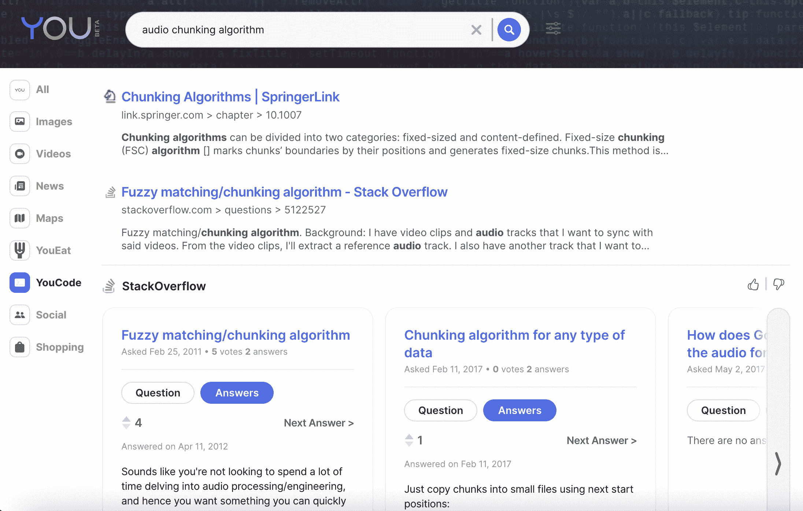
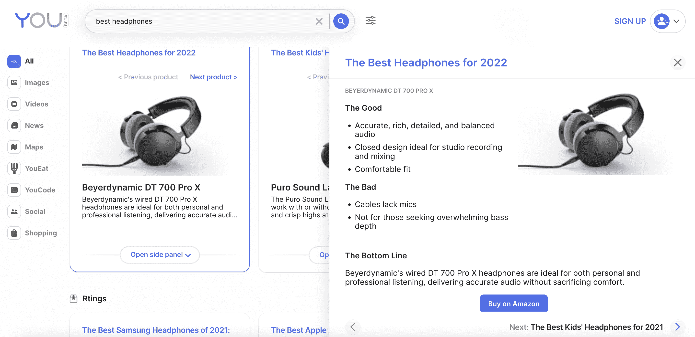
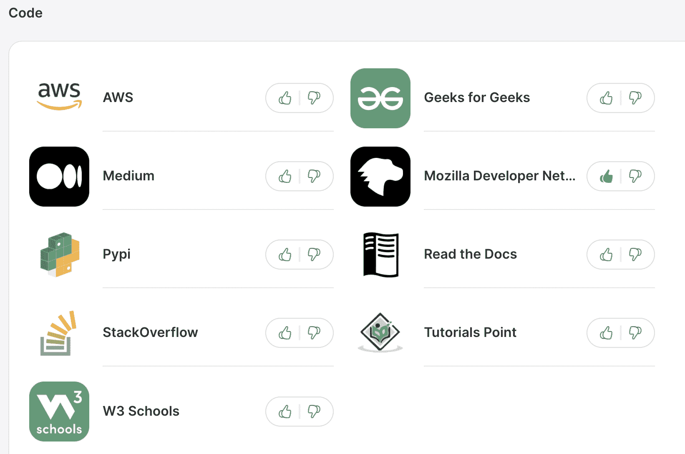
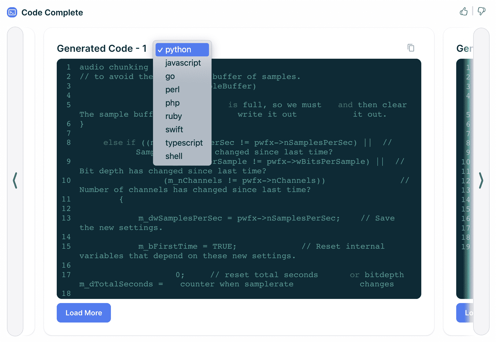

# You.com 推出开发搜索应用，包括完整的代码

> 原文：<https://thenewstack.io/you-com-launches-dev-search-apps-including-code-complete/>

You.com 是一家雄心勃勃的初创公司，凭借自然语言处理(NLP)支持的“可定制的开放搜索平台”与谷歌展开竞争。今天，它推出了一项直接针对开发者的测试服务: [YouCode](https://you.com/code) ，一种谷歌搜索和 GitHub Copilot 的混合体。

You.com 由前 Salesforce 首席科学家 [Richard Socher](https://www.linkedin.com/in/richard-socher-19363b18/) 创建，在此之前，他是深度学习初创公司 MetaMind 的创始人兼首席执行官([于 2016 年被 Salesforce 收购](https://techcrunch.com/2016/04/04/saleforce-acquires-metamind/))。Socher 是 NLP 专家，拥有斯坦福大学的计算机科学博士学位。

在 2022 年，在搜索领域挑战谷歌似乎是一个疯狂的任务，但如果有人能做到这一点，可能只会是像索彻一样的斯坦福大学博士(谷歌的创始人都是斯坦福大学的博士生，尽管两人都没有完成课程)。出于好奇，我采访了 Socher，以了解 YouCode 为开发者提供了什么——包括 GitHub Copilot 的竞争对手 Code Complete——以及开发者如何帮助 YouCode 与谷歌竞争。

## 你的代码如何工作:大量的人工智能

当你访问 YouCode 时，你会看到一个极简的网页和搜索框，就像 Google.com 一样。其中一个提示是“音频分块算法”，所以我点击了它。结果页面的上半部分显示了大量来自 StackOverflow 的结果，stack overflow 可以说是开发人员获取代码片段最受欢迎的网站。令人惊讶的是，Socher 告诉我，这种放置不是因为与 StackOverflow 的业务关系——他们只是想在结果页面的顶部显示代码查询的最佳结果，而 StackOverflow 拥有正确的数据。

You.com 结果页面

当你向下滚动搜索结果页面时，你会看到来自 GitHub、arXiv(一个免费的学术研究共享平台)等网站的列表，并阅读这些文档，以及来自其自身搜索索引的结果。似乎严重依赖第三方，但不清楚哪些是商业伙伴关系——如上所述，StackOverflow 不是官方合作伙伴。Socher 在 Twitter 上提到[“我们并不索引所有的东西——我们也合作并使用各种 API。”](https://twitter.com/bo_wangbo/status/1524503601594474496)

这就引出了一个问题:除了自己有限的索引和使用第三方 API 之外，YouCode 给开发人员查询带来了什么神奇的东西？

“自然语言处理的第一件事就是理解这是一个关于编程的问题，”Socher 告诉我。“因此，在高层次上进行分类，然后你必须对所有这些不同的应用程序进行排名，并知道哪一个更好。”

他还引用了大型神经网络，“帮助我们进行排名，对应用程序进行排名，识别和分类各种内容。”

他说，当谈到“提取有用的摘要”时，还有一些 NLP 他举了一个寻找最好的耳机的例子。如果你扩展 PCMag 的结果，You.com 会在弹出框中总结这些发现。

NLP 在行动。

## YouCode 上的应用

Socher 说，YouCode 的另一个关键部分是允许用户影响不同“应用”的排名(稍后将详细介绍该公司如何定义“应用”)。如果你注册了一个 You.com 账户，然后进入“设置你的偏好”，你可以点击一个拇指向上/拇指向下按钮来调整不同应用的排名。在下面的例子中，我给了 Mozilla 开发者网络一个大拇指，因为我喜欢他们的文档。

You.com 的应用程序

上面截图中列出的所有服务在 You.com 术语中都被称为“应用程序”。尽管上述应用都只专注于一个 web 服务(如 StackOverflow 或 MDN)，但情况并非如此。根据文档，一些应用程序在给定的类别(如购物)中“总结了网络的大部分”，而其他应用程序提供自定义功能(如 YouWrite 应用程序，它为学生和文案提供“人工智能文本生成”)。

You.com 目前的应用程序是由该公司自己开发的。“今年晚些时候，”You.com 说，它将开放其平台，以便外部开发者可以创建应用程序。感兴趣的开发者被邀请加入它的[等候名单](https://about.you.com/developers/)。

## 代码完整:类似于 GitHub Copilot

开发者最感兴趣的可能是 You.com 与 GitHub Copilot 的竞争对手，名为 Code Complete。默认情况下，这个特性隐藏在 YouCode 结果页面的底部。它为您的查询提供了一系列预填充的代码示例。例如，在“音频分块算法”查询中，我看到了三个代码示例——都是用 Python 编写的。但是你可以选择另一种语言，比如 JavaScript 或者 Go。

代码完成

“代码完整”不是自然语言处理，“Socher 说，”但它是训练它们编码的相同类型的大型语言模型。”他证实，GitHub Copilot 也采用了同样的高级方法。

虽然 Code Complete 目前是免费的，但 Socher 说他们将来可能会收费。

“副驾驶每月花费 10 美元。现在，你可以从我们这里免费获得这种模型。但这是有意义的，特别是如果我们也提供这些应用程序的底层 API，我们将为此收费。”

## 结论

我曾经共同拥有一个名为[altsearchnengines](https://web.archive.org/web/20080426192224/http://www.altsearchengines.com/)的科技博客(2007-08 年，它是读写网网络的一部分)，涵盖了数百个潜在的谷歌竞争对手。公平地说，它们都没有从山景城巨人手中夺走市场份额。所以 You.com 也不太可能。

也就是说，一个开放的开发者网络是为一个以开发者为中心的搜索引擎吸引新用户的好策略。编码完成应用程序对用户群也很有吸引力，尤其是如果它保持免费的话。然而，You.com 还需要找到一种方法，减少对 StackOverflow 等第三方服务的依赖，尤其是在与这些公司没有数据共享协议的情况下。

<svg xmlns:xlink="http://www.w3.org/1999/xlink" viewBox="0 0 68 31" version="1.1"><title>Group</title> <desc>Created with Sketch.</desc></svg>