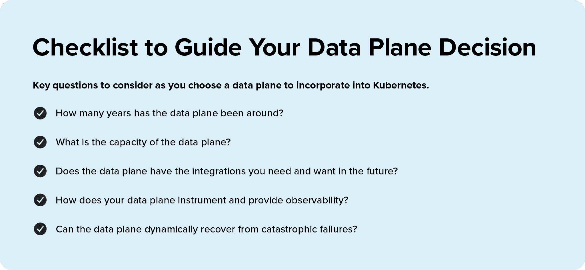

# 您的数据平面不是商品

> 原文：<https://thenewstack.io/your-data-plane-is-not-a-commodity/>

 [艾伦·墨菲

艾伦是 F5 Networks NGINX 服务网格的高级产品经理。](https://www.linkedin.com/in/malanmurphy/) 

宝马生产优质汽车。它们是漂亮的驾驶机器；这意味着他们的一切都不便宜。例证:在许多车型上，替换轮胎的价格是 250 美元一个，你必须从经销商那里购买。这些轮胎通常是与轮胎制造商密切合作的结果，并根据汽车的驱动力量身定制。现在，你可以购买打折的通用售后轮胎，但那会降低你的性能。

因此，如果您打算在一个[服务网格](https://www.nginx.com/resources/glossary/service-mesh/)和一个 [Kubernetes](https://kubernetes.io/) 部署中投入大量时间、精力和工程时间，为什么您会想要购买相当于廉价轮胎的东西呢——在这种情况下，一个更新的、最少测试的数据平面，其语言甚至可能不是为处理线速应用流量而设计的？因为，事实上，您的数据平面是您的微服务的关键所在。数据层将直接影响客户对性能的看法。数据层是可以看到问题的地方。数据层将最先感受到扩展需求。响应缓慢的数据平面会降低整个 Kubernetes 引擎的速度，并影响系统性能。

像轮胎一样，日期平面也相对容易更换。你不一定需要大手术来挑选你认为最好的一个，并把它们安装在你最喜欢的服务网格和 Kubernetes 平台上，但代价是什么？

## 指导您做出数据平面决策的清单

当您构建一个 Kubernetes 环境并选择一个服务网格来支持它时，这里有一个清单来指导您。我们涵盖了您在采用数据平面(例如[入口控制器](https://www.nginx.com/resources/glossary/kubernetes-ingress-controller)或[反向代理](https://www.nginx.com/resources/glossary/reverse-proxy-server/)解决方案)整合到 Kubernetes 时可能需要考虑的关键问题，并确保您获得所需的性能。最重要的是，问问你自己，你的数据平面是否能够处理你的服务网格和应用程序将向它抛出的所有性能。

### 1.数据飞机已经服役多少年了？

有一个很好的理由说明为什么 Linux 和 MySQL 等软件在生产中运行应用程序时最值得信赖。他们有多年的服务经验，在各种各样的挑战性环境中提供大规模的应用程序。理想情况下，您的数据层应该使用十年以上。当然，这要早于许多 Kubernetes 的部署。然而，现实情况是，数据平面的核心正在执行负载平衡器和反向代理多年来所做的相同工作:服务、整形和保护 HTTP 流量。因此，我们没有理由不站在巨人的肩膀上，部署那些经受住了时间考验、被大型组织信任在生产中运行的核心技术，用于最关键的应用程序。

即使您最初没有在 Kubernetes 中运行任务关键型工作负载，总有一天您会不可避免地到达那里。关键是要有一个服务时间足够长的数据平面来经受实战考验。

### 2.数据平面的容量是多少？

大多数数据平面发布每秒连接或事务数量的容量数据，以及资源消耗要求。这应该是赌桌。如果容量偏低，您知道在扩展时需要更换数据层，以获得更高的容量。或者，您需要设计一个水平扩展的系统。这可能会增加成本和复杂性。至于那些容量数字，请不要全信。基本容量数字可能只是故事的一部分，而且在负载下，初始资源使用量可能会呈指数级增长，一旦数据平面开始处理安全流量，这些有吸引力的低 CPU 数字就会失效。

为了真正了解数据平面在您的特定环境中的表现，您需要对其进行大规模测试，并且需要与在生产中使用过它的其他人交谈。有时，在达到容量阈值之前，性能就会下降。因此，请检查容量验证测试，但也要亲自验证数据平面是否能像宣传的那样交付。

### 3.它有您未来需要和想要的集成吗？

您的服务网、Kubernetes 环境和应用程序是活生生的呼吸系统。随着您的成长，您还可能需要不同类型的应用程序。不同的团队可能会选择不同的语言、数据存储、应用服务器和框架来交付他们的应用程序。集成较少的数据层将限制这些选择。这会以不舒服的方式束缚你的团队。

例如，如果一个团队想要使用一个图形数据库来限制所需的 API 调用的数量，那么它将需要一个在大多数情况下能够轻松支持 GraphQL 的数据平面。了解添加集成有多容易，以及支持数据平面的公司或社区是否正在快速创新集成，对于计算数据平面继续满足您未来需求的能力来说是一份很好的数据。

### 4.数据平面如何测量和提供可观测性？

停机发生；这是必然的。真正要问的问题是应用停机的成本是多少，以及您的数据平台如何处理灾难性故障？在开发集群中，失败的代价可能很小，甚至为零。生产集群中的停机时间会很快变得非常昂贵，如果您的平台不能提供跨平台的洞察力和可观察性，代价会更大。它会影响其他应用程序，使客户和关键业务流程离线，并导致安全漏洞。在数据层面，关键是要有[可见性工具](https://www.nginx.com/blog/how-to-improve-visibility-in-kubernetes/)来近乎实时地对停机进行故障排除，以便您可以快速跟踪停机和根本原因。同样重要的是快速、轻松地访问应用程序和服务数据的灵活性，而不需要精通解析日志文件或时间序列的人。

### 5.您的数据平台能否从灾难性故障中动态恢复？

为了快速恢复，服务网格必须能够对基础设施和应用程序故障做出动态响应。在 Kubernetes 的世界里，动态是一个相对的术语。我们依靠 Kubernetes 作为我们的弹性控制平台，但有些事情 Kubernetes 无能为力，例如 pod 的可用时间。在某些云中，动态可能意味着五分钟后重启。在其他情况下，重启速度更快。在 Kubernetes 中，我们倾向于用秒来度量动态重启时间。因此，请确保您了解您的服务网格和底层云的实际功能，以便快速从故障中恢复。反向代理[边车](https://www.nginx.com/resources/glossary/sidecar/)可以说是你网络中最重要的组成部分。就像那些打折的轮胎一样，如果边车倒下了，你的服务对服务的交通就停止了。集群中运行的所有应用程序都将停止工作。

您相信您的 sidecar 代理能够提供企业弹性和恢复吗？如果答案是“我不确定”，那么您选择服务网格是在冒巨大的风险。

## **结论:您的数据平面很重要，因此请做出相应选择**

这并不是说服务网络的其他部分不重要。如果你讨厌你的控制平面，它在帮助你管理和理解你的服务流量和应用拓扑方面做得很差，那么你的服务网格也不是一个令人愉快的地方。也就是说，许多正在考虑服务网格选择的人可能希望同等考虑他们的服务网格中与客户和其他服务接触最多的部分。这就是数据层。在您的服务网格上放置正确的数据平面将为您提供您需要的类似宝马的性能，以及在所有条件下都敏捷、响应迅速、可靠且值得上路的服务网格。

<svg xmlns:xlink="http://www.w3.org/1999/xlink" viewBox="0 0 68 31" version="1.1"><title>Group</title> <desc>Created with Sketch.</desc></svg>