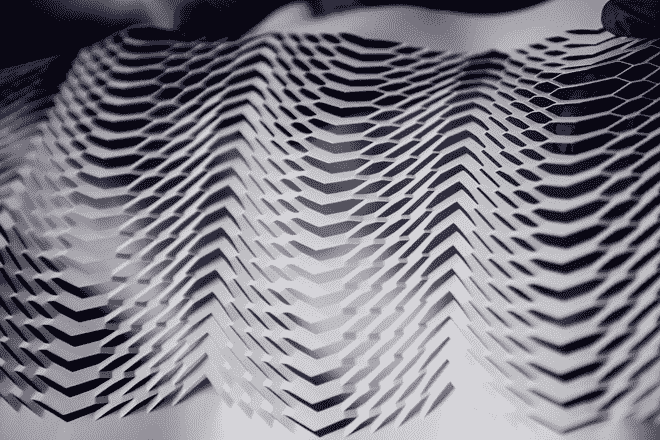
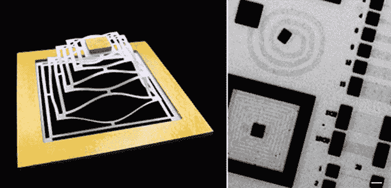
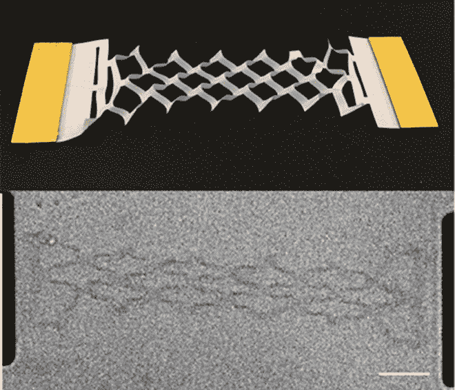
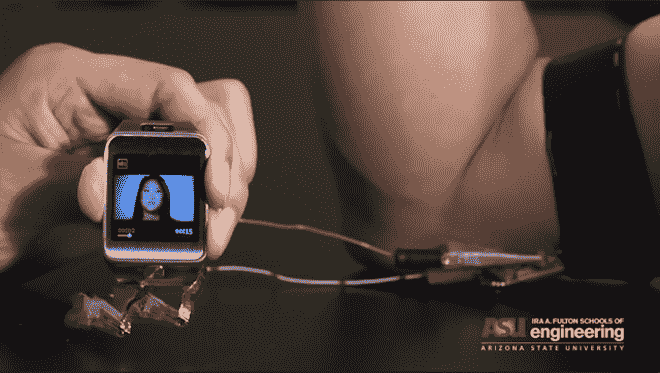

# 你未来的电脑屏幕可能会弯曲、扭曲和伸展

> 原文：<https://thenewstack.io/your-future-computer-screen-may-bend-twist-and-stretch/>

折纸艺术是一项世代相传的休闲活动，令人惊讶地被转化为新技术，比如这些令人敬畏的自动折叠折纸迷你机器人，有朝一日可能会进行纳米手术。现在，日本剪纸艺术，或称 [kirigami](https://en.wikipedia.org/wiki/Kirigami) ，可能帮助工程师开发出可弯曲、可拉伸和柔性的电子产品，有朝一日可能会出现在我们的[衣服](https://thenewstack.io/googles-project-jacquard-conductive-threads-that-turn-fabrics-into-touch-screens/)上，甚至是我们的身体里。

传统的电子设备使用的材料或由电池供电，往往是不灵活，易碎和刚性的。但随着石墨烯和其他导电复合材料等新材料的出现，这种情况将会改变。世界各地的研究团队正在试验将剪纸技术转化为新型晶体管和电池的可能性，这种晶体管和电池可以弯曲、扭曲和变形，而不会影响整体性能，或潜在地延长电池寿命。

## 可弯曲显示屏

密歇根大学的一个团队在“ [Nature Materials](http://www.nature.com/nmat/journal/vaop/ncurrent/full/nmat4327.html) ”上发表了一项研究，研究了使用 kirigami 技术通过在导电纸复合材料上制作小而精确的切口来增加其弹性。由于许多不可预测的“应力集中缺陷”和纳米元件在高应力下实际变硬的趋势，在纳米材料中创造灵活性可能是困难的。

但是，密歇根大学工程学教授尼古拉斯·科托夫博士说，切割这些材料的 kirigami 方法似乎是绕过这些限制的一种方法。但当我们把 Kirigami 的图案放在那张纸上时，结果证明我们确实可以大幅增加应变，至少增加几个数量级。”

研究人员发现，用 kirigami 图案切割的复合材料板可以承受比传统导体材料多 370%的应变，因为微小的切口会将应力分布在更大的区域上——这可以转化为柔性、可弯曲的屏幕。

## 受 Kirigami 启发的石墨烯基生物植入物

康乃尔大学的科学家们也在石墨烯上试验剪纸技术，石墨烯是一种高度导电的碳基材料，只有一个原子厚。作为刚性和易碎硅元件的替代品，研究人员希望创造出具有可拉伸和可变形电极、弹簧和铰链的晶体管，有朝一日可能出现在弹性电子产品中，或者微小的生物兼容植入物，可以沿着身体移动，几乎没有不适。

在发表于“ [Nature](http://www.nature.com/articles/nature14588.epdf?referrer_access_token=mszNNP5HFvv48qVMHVXz6dRgN0jAjWel9jnR3ZoTv0N3HoRPYRVQpCZmVMBZFpoKi8Y7VhvO3d8UcapAaMAzNAmRzp3KAMrqt5cHqtkZsuE6cTb2d_IDIH9-qrtjYZVg_hattbCUcXS9prsyVDHDGdIovp9qIMmYQ68xQqHs3fJoJyZxBy0RFk6dzoP-mxOaJAf5Rk6UkWKOtynnhuMFaGm9QULRAwLpj8-QkWeAbP_9sj8qUOt1MgEZh29EVwSs&tracking_referrer=physicsworld.com) ”的研究中，康奈尔大学的研究人员描述了他们如何通过在石墨烯片上层叠小金垫来制作金冠金字塔，然后使用光刻技术切割它们。尽管这些切割允许材料拉伸到其原始尺寸的 240 %,但电导率保持不变。

该团队还制作了可操纵的石墨烯“铰链”，可以将两个金垫连接在一起。这两种模型都具有惊人的弹性:金字塔在性能下降之前经受住了 1000 次变形，而铰链则经受住了 10000 次循环。

团队成员、纳米科学家保罗·麦克尤恩说:“所有的实验都是在水中用光学显微镜完成的。如果我们进入纳米尺度，我们将什么也看不见。”然而，麦克尤恩假设，可以用这些技术制造更小的、可折叠的、纳米尺度的装置——能够穿过细胞膜。

## 可穿戴设备的柔性电池之路

根据亚利桑那州立大学最近完成的另一项研究，Kirigami 也有可能为柔性电池铺平道路，该研究发表在“[科学报告](http://www.nature.com/srep/2015/150611/srep10988/full/srep10988.html)和“[自然](http://www.nature.com/nature/journal/v524/n7564/full/nature14588.html) *”上。*为了解决智能手表和健身追踪器中固定尺寸电池的电池寿命短的问题，研究团队将铝箔切得像 kirigami 一样，在其上涂上一层导电材料，然后将其安装到智能手表上。

他们发现，这种缠绕在手臂上的柔性锂离子电池可以伸展到原始大小的 150%，而不会影响智能手表的视频播放性能。领导该团队的副教授 Hanqing Jiang 博士表示，这可能意味着可穿戴电子设备可以拥有更大、更灵活的电池，从而提供更持久的电力:“基于 kirigami 的方法可以很容易地扩展到其他应用，以开发高度可拉伸的设备，从而对可拉伸和可穿戴电子设备领域产生深远而广泛的影响。其他应用可能包括智能手环和智能头带。”

技术的趋势是让它在我们的生活中越来越“不显眼”——让它更多地成为一种环境元素，而不是你盯着看或拿在手中的屏幕或设备。技术几乎看不见，但却存在；融入我们的[家](https://thenewstack.io/wikihouse-open-source-sustainable-house-designs-that-anyone-can-build/)，我们的[厨房](https://thenewstack.io/ikeas-concept-kitchen-of-2025-it-cooks-interacts-and-composts/)，我们的[衣服](https://thenewstack.io/googles-project-jacquard-conductive-threads-that-turn-fabrics-into-touch-screens/)，我们的日常习惯，甚至到了它[预测和适应我们的情绪状态](https://thenewstack.io/affective-computing-emotionally-intelligent-machines)的地步。让小工具变得灵活可能是一种将新的技术堆叠编织到我们生活结构中的方法，允许它根据需要移动，而不被注意到。

图片:密歇根大学，康奈尔大学，亚利桑那州立大学。

<svg xmlns:xlink="http://www.w3.org/1999/xlink" viewBox="0 0 68 31" version="1.1"><title>Group</title> <desc>Created with Sketch.</desc></svg>