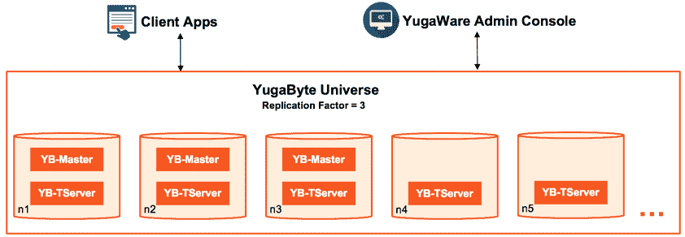
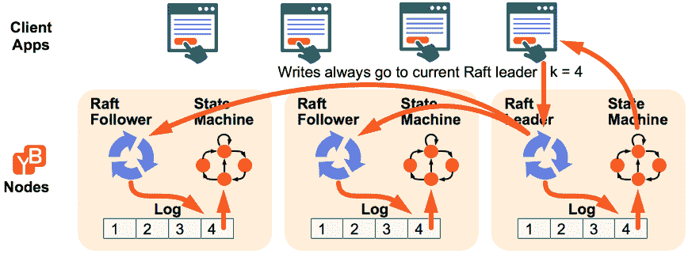

# YugaByte:解决 SQL 和 NoSQL 难题的新数据库

> 原文：<https://thenewstack.io/yugabyte-new-database-solve-sql-vs-nosql-dilemma/>

公司花了太多时间来权衡整个 SQL 与 NoSQL 难题，而不是关注他们用这些系统旨在存储的任务关键型数据构建的云原生应用程序。

无论如何，这是 YugaByte 数据库的创始人提出的论点。他们希望像 Docker 和 Kubernetes 对应用层那样简化数据层。宇迦在印地语中的意思是*时代*或*时代*，表明创始人对其产品的长远观点。该公司于上周悄然出现。

“我们并不真正像 SQL 数据库或 NoSQL 数据库；创始人兼首席执行官 [Kannan Muthukkaruppan](https://www.linkedin.com/in/kannanmuthukkaruppan/) 表示:“我们正在真正简化每个企业整合在一起的数据基础设施。

在该公司从 MySQL 和 Memcache 过渡到名为 [Tao](https://www.usenix.org/conference/atc13/technical-sessions/presentation/bronson) 的内部解决方案期间，该公司 25 名以上的员工团队中有 9 名来自脸书。他们是 Hbase 项目的委托人，这个项目也在脸书被大量使用。

其他科技巨头也开发了自己的内部解决方案来解决 YugaByte 解决的问题，比如谷歌的 [BigTable](https://thenewstack.io/googles-cloud-bigtable-and-the-data-services-ecosystem/) 和 [Spanner](https://thenewstack.io/google-cloud-spanner-view-field/) ，以及 Pinterest 的 [Zen](https://www.infoq.com/presentations/zen-pinterest-graph-storage-service) 。

阮冈纳赞说，大多数企业仍然使用传统的 SQL，它不能提供云的敏捷性，也没有在现代应用程序中构建功能所需的所有访问模式，如机器学习、时间序列和 Spark 集成。对于欺诈检测、推荐引擎和物联网等应用程序来说尤其如此，这些应用程序需要可扩展的基础架构，这种基础架构具有故障恢复能力、地理分布和跨云的可移植性。

NoSQL 数据库倾向于专注于不同的访问模式，比如 MongoDB 专注于文档模型，Cassandra 专注于高容量。此外，NoSQL 并不完全是为任务关键型应用程序设计的，因为它不一致，会损害数据完整性。

他所指的“混搭”通常是多个数据中心、以复制方式在主从配置中保存关键数据的分片 SQL 设置，以及针对备用访问模式(时间序列、图表、灵活的模式文档等)的 NoSQL 设置。然后总是有一个缓存来实现低延迟访问，这也是手动分片和复制的。

该应用程序计算出哪些数据是绝对重要的，需要转到 MySQL，如何访问数据，哪些可以转到 NoSQL，哪些数据子集必须放在缓存中以实现低延迟访问。这取决于使用模式，而不是应用程序架构，因为使用模式会改变，数据模式也必须发展。然后，您必须弄清楚如何在 MySQL 主从集群或缓存集群之间复制数据。

所有这一切都要付出巨大的开发和运营成本才能保持运行，而这些人甚至都不是应用程序的开发者。他解释说，由于系统如此脆弱，这不可避免地意味着不一致和数据丢失，这需要数小时的调试。

Yugabyte 强大的写一致性。

## 解决棘手问题

传统上，您会为每种访问模式选择不同的筒仓——灵活模式、键值、时序、关系。YugaByte 构建在一个公共的核心上，上面是每一种访问模式。

[核心](https://docs.yugabyte.com/architecture/concepts/)是一个横向扩展数据结构。它建立在 Raft 之上，作为共识协议，允许高度一致的复制和零数据丢失。它使用 DocDB，YugaByte 专有的面向文档的存储格式——一种高度定制形式的 [RocksDB](http://rocksdb.org/) ，提供低延迟访问和高密度数据。它运行在流行和已知的 API 上。

“我们不想创新，不想给世界带来再学习一个数据库 API 的痛苦，因为已经有足够多的 API 了。…现在你可以拿起一个为 Cassandra 或 Redis 编写的应用程序，指向 YugaByte，它就会工作。我们与司机完全兼容；你不需要改变任何东西，”阮冈纳赞说。SQL 支持正在进行中。

在这些 API 下，因为它使用一个通用的数据平台，所以它提供了自动化的分片和负载平衡，并在幕后处理故障转移和复制。

它可以在任何云提供商上运行，通过集成的 API，想要在其上构建应用程序的人可以很快做到。

它通过带来强大的一致性、易操作性和 ACID 事务解决了 NoSQL 的痛点。对于 SQL 世界，它提供了自动分片、自动负载平衡和云原生操作。它还提供同步/异步副本、混合云应用和零数据丢失，以满足多数据中心的需求。

这家总部位于加州森尼维尔的公司是由阮冈纳赞的穆图卡鲁潘和米哈伊尔·博廷于 2016 年创立的。它已经从光速风险投资伙伴那里获得了 800 万美元的首轮融资。它提供开源的[社区版](https://github.com/YugaByte/yugabyte-db)和完全支持的企业版。

它的早期接入计划有 8 到 10 个客户，预计将在 2018 年前四个月全面上市。

<svg xmlns:xlink="http://www.w3.org/1999/xlink" viewBox="0 0 68 31" version="1.1"><title>Group</title> <desc>Created with Sketch.</desc></svg>