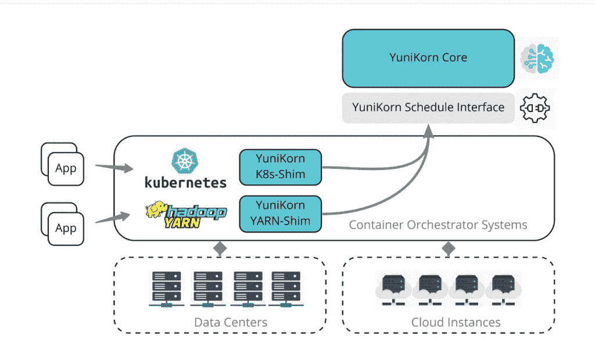

# yuni Korn:Kubernetes 默认大数据调度器 ML 的替代方案

> 原文：<https://thenewstack.io/yunikorn-alternative-to-kubernetes-default-scheduler-for-big-data-ml/>

大数据和机器学习资源调度器 [YuniKorn](https://yunikorn.apache.org/) 已经在 Apache 软件基金会内获得了[的顶级地位](https://blogs.apache.org/foundation/entry/the-apache-software-foundation-announces82)，并发布了它的 1.0 版本。

YuniKorn 项目管理委员会成员 [Wilfred Spiegelenburg](https://www.linkedin.com/in/wilfred-spiegelenburg-13ba1b1/) 专注于与 Kubernetes 合作，认为年轻的 Apache 项目必须与[云本地计算基金会](https://cncf.io/?utm_content=inline-mention)和 [Kubernetes 社区](https://thenewstack.io/category/kubernetes/)密切合作，以达到所需的集成水平。

上周，我在 KubeCon+CloudNativeCon EU 采访了 Spiegelenburg，以了解更多关于 YuniKorn 及其发展方向的信息。

YuniKorn 是一个用于机器学习和大数据应用的[资源调度器](https://github.com/apache/yunikorn-core)。2019 年起源于 Cloudera，2020 年 1 月进入 Apache 孵化器。

它的创建是为了在大规模、多租户和云原生环境中高效地实现各种工作负载的细粒度资源共享。YuniKorn 为混合工作负载提供了统一的跨平台调度，这些工作负载由大量分布式系统中的无状态批处理工作负载和长期运行的有状态服务组成。

针对在 Kubernetes 上运行 Apache Spark 进行了优化，Apache YuniKorn 的性能使其成为 Kubernetes 默认调度程序的可选替代程序。

其特点包括:

*   *   它在内部和各种公共云环境中运行，并通过更高的吞吐量最大化资源弹性。
    *   分层资源队列—它可以有效地管理集群资源，并能够控制每个租户的资源消耗。
    *   应用感知调度—它可以识别用户、应用和队列，根据提交顺序、优先级、资源使用等进行调度。
    *   作业排序—它提供了内置的强大调度功能，支持基于公平的跨队列抢占、层次结构、可插拔节点排序策略、抢占等。
    *   中央管理控制台监控不同租户的性能。仪表板跟踪受管节点、集群、应用程序和队列的资源利用率。
    *   效率—它减少资源碎片并主动触发扩展。云弹性降低了总体运营成本。

最近发布的 1.0 版本是自进入 Apache 孵化器以来的第五次更新，其特性包括:

*   降低内存和 CPU 使用率
*   扩展指标和诊断信息
*   支持未来升级的新部署模式
*   插件部署模式的技术预览

用户包括阿里巴巴、苹果、Cloudera、Lyft、Visa 和 Zillow。

总部设在澳大利亚墨尔本的 Spegielburg 飞到西班牙巴伦西亚的 KubeCon，宣传该项目，并提高 Kubernetes 社区的兴趣。(为了篇幅和清晰起见，这段对话已经过编辑。)

**新堆栈:告诉我这个项目是如何开始的。**

因此，我们在大约 3 年半前开始在 Cloudera 内部与一个由几个人组成的小团队合作，它正在寻找一个真正好的解决方案，来解决我们在 Kubernetes 上看到的调度和安排问题。我们还认为，在那个时候，我们需要一种纱线和 Kubernetes 相结合的调度方式。…大约三年前，我们从 Cloudera 对其进行了开源，并将其列为通用开源。这就是我们有一个可行的概念验证产品的原因。大约六个月后，我们把整个项目捐给了 Apache，让它孵化。

**那么，为什么一家公司会选择 YuniKorn 而不是 Kubernetes 的默认调度程序呢？**

当一家公司有混合工作负载时，应该选择 YuniKorn。当集群运行混合工作负载、服务和批处理/HPC 时，通常需要工作负载排队或共享配额等高级调度选项。使用 YuniKorn 可以为您提供所有这些选项，并有助于改善用户体验。由于更好的资源利用，公司也看到了成本节约。

因为它是默认调度程序的替代程序，所以很容易试用。不需要长时间的设置，只需通过提供的舵图部署 YuniKorn 并开始使用它。停止 YuniKorn 会将集群恢复到原来的状态。

**你为什么决定把项目放在 Apache？**

因此，我们在当时 Cloudera 的背景下研究了 CNCF 和 Apache。我们做 Hadoop 和所有这些东西已经很多年了。所以我们真的很乐意这样做，知道如何工作，知道我们将如何发展社区。所以在那一点上，它是“让我们把它交给 Apache，围绕产品建立一个社区，看看我们从那里去哪里。”…从那时起，我们已经从 Cloudera 内部的少数几个人成长为大约 30 或 35 名正式成员。PMC 大约有 20 到 25 人。

那么，自从你进入孵化阶段以来，你在技术上取得了哪些成就？

很多。变化很大。所以我们只关注库伯内特人的一面。我们把纱线的事情放在一边，因为我们看到了更多的需求和更多的兴趣在 Kubernetes 方面的事情。因为 Yarn 有一个很好的批处理作业调度程序。这一点，尤其是在那个时候，在库伯内特完全消失了。

这也是我来这里的原因。我们看到这种兴趣也来自 Kubernetes 的观点。但是两三年前，它还不存在。所以这是一个很大的变化。

在孵化期间，我们发展了社区。我们已经稳定了产品，做了许多大的改变，增加了新的功能。在那段时间里，新的日程安排方式被加入进来。大约在(孵化出来的)这段时间，我们也开始考虑发布我们第一个主要版本的时间。我们一直有一个零点几的版本，并且我们已经为第一个主要版本做好了准备。…

我们推迟了我们的第一个主要版本，直到我们毕业后，因为它对我们的构建方式和其他一些事情产生了一些影响。…于是毕业了，然后两周后，我们发布了 1.0。

那么告诉我一些你加入的新的日程安排方式。

我们从我们的用户那里看到的是，他们想要进行分组调度，以及不同的分类方式。人们在云中使用它，但也在内部使用。…因此，我们根据我们看到的需求实施了团队调度。我们改变了我们允许节点或基础架构排序的方式，并在确保最终用户能够简单控制我们的配置方式的同时实现了这一点。与 Kubernetes 的做事方式保持一致，因为这是我们现在最关注的领域。

所有这些我们都是分几个步骤完成的。所以在我们做完整的帮派安排之前，我们首先说，“好吧，让我们简单点。”一个应用程序启动，然后下一步应用程序启动。所以我们点的好一点。然后我们说，“好吧，这还不够好。顾客要求更多的用途。社区说我们如何能做到这一点？我们能这样做吗？”我们说，‘好吧，如果我们把所有这些都放在帮派计划的保护伞下，那么我们就能做到。“所以我们采取了一个释放，工作在这一切。把它放在外面。这是系统中目前使用频率很高的功能。

**那么，作为顶级项目，这个项目会怎么样呢？**

重要的是，再一次，发展社区。我们已经看到了 Kubernetes 中所有与时间安排有关的事情。我们看到更多的人被收养。…我们希望尽可能多的人使用我们的产品，我们希望在产品中做一些[新东西](https://yunikorn.apache.org/community/roadmap/)。更进一步。

**什么样的新事物？**

我们希望提供更多类似业务的设置，如恢复和重启，确保升级可以在没有任何影响的情况下即时完成。因此，如果企业(需要)一个新版本，他们只需按下按钮，就可以实现，而不会对基础架构产生任何影响。这意味着我们还必须进行灾难恢复，以确保 100%的时间都能正常工作。

另一件事是先发制人。人们一直在改变他们的配置，当我们改变配置时，这可能意味着现在运行的一些工作负载不应该在那之后再运行。因此，我们需要能够消除这种现象，实现自动化。

我们看到的一些附带案例，来自用户的反馈，特别是针对 Kubernetes 的，是守护进程集。日程安排得不太好。因为这些年来 Kubernetes 在我们的领导下发生了变化——我们有了一个移动的目标。所以他们改变了一些东西，我们稍微适应了一下，我们发现(它)还不够好。所以我们需要进一步改变和适应。

一个很大的变化是他们大约一年前推出的新的 Kubernetes 调度框架。在我们的主要版本 1.0 中，我们还发布了基于调度框架的新部署类型的技术预览。(我们的预览版)需要在接下来的几个版本中变得成熟。人们可以开始使用它，但我们不能保证它 100%适合生产。

但是 1.0 已经可以生产了吗？

是的，它已经可以生产了。我们有许多客户在生产环境中使用标准部署模式运行它。

**那还有什么？**

我们有一个悬而未决的项目。我们有 Apache，但我们是在 CNCF 之上构建的，云原生的东西。我认为我们是 Apache 中第一个如此接近系统集成的项目。我们会看到我们的进展，这也是我在这里的部分原因，因为我们看到了 CNCF 提供者代码在集成方面的一些问题。我们需要合作，我们需要融合，我们需要相互交流。

幸运的是，在我过去的两天里，库伯内特人看到了同样的问题。他们明白，他们从他们的用户那里看到了同样的问题。他们认为 UniKorn 可以解决一些问题，但是他们说他们想把 UniKorn 中的东西拿出来放到 Kubernetes 中。我说，“如果你能给我们提供这些，那太好了。然后，我们不必去做，我们不必去维护它，我们只是做你的事情，在你已经提供的基础上。”这让我们更容易。所以这将是一个挑战，因为我们仍然想创新。我们不能等待 Kubernetes 做什么，另一方面，Kubernetes 做的事情可能会阻碍我们的创新。

我们需要保持一致。这将是一个棘手的部分。

<svg xmlns:xlink="http://www.w3.org/1999/xlink" viewBox="0 0 68 31" version="1.1"><title>Group</title> <desc>Created with Sketch.</desc></svg>