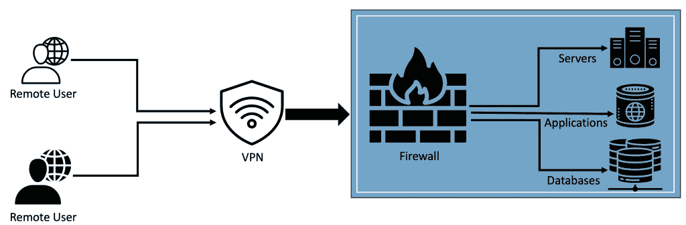
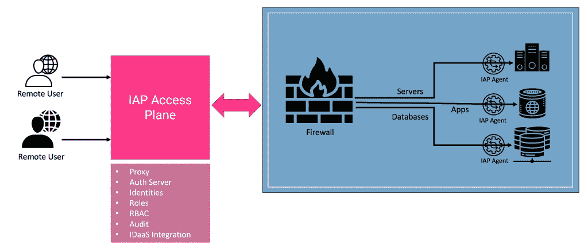

# 具有身份感知代理的零信任网络安全

> 原文：<https://thenewstack.io/zero-trust-network-security-with-identity-aware-proxies/>

不久前，企业还依靠部署在网络边界内的 VPN 和防火墙来保护其基础架构和应用程序，从而为用户提供远程访问。一旦用户获得了对网络的[访问权，他们就被默认为可以访问网络、服务器、应用程序和各种端点。](https://thenewstack.io/why-access-management-is-step-one-for-zero-trust-security/)

在当前的云环境中，BYOD、[远程工作](https://thenewstack.io/remote-work-is-great-but-far-from-universal/)和分布式[微服务](https://thenewstack.io/microservices-101/)，VPN 和传统的外围安全机制无法满足保护企业安全的巨大需求。隐含地信任网络中的实体的理念带来了巨大的安全风险。

企业内的每项资产——网络、子网、服务器和台式机、数据库、 [Kubernetes 集群](https://thenewstack.io/secured-access-to-kubernetes-from-anywhere-with-zero-trust/)、内部托管的应用程序和第三方应用程序——都必须得到独立保护。每次用户或进程访问内部资源时，都必须根据预定义的策略对其身份进行身份验证，以确定允许对该资源执行的操作。

“在他们被证实之前不要相信任何人”的想法是零信任模型的核心原则。它转化为一种体系结构，在这种体系结构中，用户/进程在每一级都被认证和授权，即使该实体享有访问网络的最高特权。

实施[零信任](https://thenewstack.io/what-is-zero-trust-security/)对于企业 IT 来说并不是一件容易的事情。一些挑战包括用户身份的蔓延、内部应用的激增、对第三方 SaaS 应用的依赖以及混合、多云和边缘架构的兴起。

用户的配置文件和身份存储在内部 LDAP 目录服务、外部 SSO 平台和自定义数据库中。为跨不同来源的概要文件定义一个统一的基于角色的访问控制是极其困难的。

企业数据中心和公共云中托管的内部 web 应用程序也是如此。必须保护 HTTP(S)端点以防止外部访问。现已成为企业 IT 不可或缺的一部分的 SaaS 应用程序自带身份管理机制，增加了身份验证和授权的复杂性。部署在混合、多云和边缘环境中的应用程序受到高度分散和脱节的访问控制策略的困扰。

最后，获得对这些高度多样化和分布式资产的访问和使用的洞察力带来了另一个挑战。对每个资产执行审计跟踪、访问日志和审查过去的会话几乎是不可能的。但是，审计和审查访问不仅是[零信任](https://thenewstack.io/what-is-zero-trust-architecture/)的一个重要方面，也是合规性的一个强制性要求。

### 身份感知代理(IAP)的兴起

身份感知代理(IAP)用一种现代的、上下文感知的和身份感知的认证和授权方法取代了传统的基于 VPN 的访问控制机制。IAP 没有为每个资源(如服务器、Kubernetes 集群或应用程序)定义访问策略，而是通过映射每个资源注册的身份来集中策略定义和访问控制。这使得企业 IT 部门能够更好地实施零信任安全。

从技术上讲，IAP 有两个核心组件—接入层和代理。接入平面具有认证和代理组件，负责将会话隧传到向其注册的每个代理。代理运行得更靠近代表服务器、Kubernetes 集群、数据库服务器或 web 应用程序的资产。

访问平面维护用户、角色以及将它们绑定在一起的策略的列表。当用户登录到访问平面时，他被认证，并且他的身份被确定以导出相关联的角色和策略。每个经过身份验证的用户都直接映射到向目标资源注册的用户。

通过身份验证后，代理将模拟用户来访问资源。在这个过程中，访问控制策略是基于经过身份验证的用户的角色实施的。因为代理知道身份和上下文，所以它被称为身份感知代理。

靠近资源运行的代理负责按照预期的协议执行策略和翻译动作。例如，代表 MySQL 数据库的代理知道用户的原始身份，因此应用特定于资源的策略。类似地，当 Kubernetes 用户试图访问一个集群时，代理负责执行策略并翻译通过 Kubernetes API 发起的操作。代理部署在防火墙后面或虚拟专用网络环境中。

IAP 还带有一个 CLI 或 GUI 形式的专用客户端，允许用户登录到接入层。接入层可以在云中的托管环境中可用，或者可以在企业数据中心内自托管。它可以通过定义明确的 DNS 名称或静态 IP 地址进行访问。客户端、接入平面和代理之间的通信基于行业标准机制进行加密。

IAP 的基于角色的访问控制(RBAC)独立于用户和资源。一旦代理对用户进行身份验证，RBAC 就会生效。这种策略与原始身份的分离使其具有高度的可伸缩性。IAP 可以对每个连接的会话实施多因素身份验证。

由于这些策略是由专门的团队集中定义和管理的，因此它为企业范围的访问控制带来了更好的治理和可管理性。无论用户配置文件存储在哪里(LDAP、基于云的目录服务和 IDaaS)，IAP 都会对经过身份验证的用户应用相同的一致策略。这些策略在用户的会话过期或明确的注销操作之前一直有效。

IAP 并不局限于远程或交互式用户。它可以很容易地扩展到基于基础设施如代码(Code)和可编程基础设施的自动化工具。例如，Jenkins 可以使用 IAP 进行基于身份的持续集成和部署，并拥有最少的权限。对于需要 SSH 密钥来自动化软件安装和配置的 Ansible 剧本也是如此。

熟悉反向代理如 [ngrok](https://ngrok.com) 的开发者可能会认为 IAP 是类似的。但两者之间的关键区别是身份意识和 RBAC 政策。

考虑零信任安全的企业可能会认为 IAP 是传统的基于 VPN 的远程访问的现代替代品。 [Google Cloud IAP](https://cloud.google.com/iap#section-3) 、 [Teleport](https://goteleport.com) 、 [StrongDM](https://www.strongdm.com) 、 [HashiCorp Boundary](https://www.boundaryproject.io) 和 [F5 BIG-IP APM](https://www.f5.com/products/security/access-policy-manager) 是市场上的一些 IAP 产品。

作为 IAP 系列的一部分，我将介绍开源版本的 [Teleport](https://goteleport.com/docs/getting-started/) 来访问服务器、数据库、Kubernetes 集群和 web 应用程序。敬请关注。

*披露:这篇文章的作者已经为 Teleport 博客写了文章。*

<svg xmlns:xlink="http://www.w3.org/1999/xlink" viewBox="0 0 68 31" version="1.1"><title>Group</title> <desc>Created with Sketch.</desc></svg>