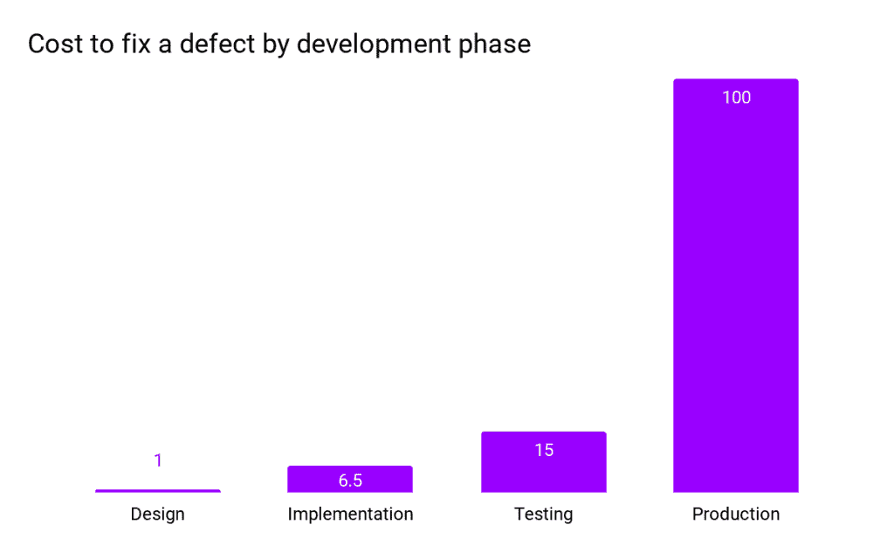

# 零信任安全和软件开发生命周期

> 原文：<https://thenewstack.io/zero-trust-security-and-the-software-development-lifecycle/>

 [帕万贝拉加蒂

帕万是印度增长黑客领域的先驱，是 DevOps 的影响者和谷歌认证的数字营销人员。他写了 100 多篇关于 DevOps 的文章。他通常写 DevOps，营销和增长黑客。他是世界上一些顶级网站的客座撰稿人。他目前是 JFrog 的 DevOps 倡导者。](https://www.linkedin.com/in/pavan-belagatti-growthmarketer/) 

自动化已经以各种形式存在了几十年，直到现在我们才开始看到它的全部潜力。

软件开发生命周期(SDLC)的自动化可以显著提高质量保证、开发人员的生产力，并减少在特定任务上花费的时间。公司已经开始在整个 SDLCs 的安全实践方面投入更多，以保护数据和防止恶意软件攻击。

随着行业的变化，安全实践也在不断发展。从传统的安全性实践(安全性被认为超出了开发团队的范围)到使安全性成为 SDLC 中的优先事项，已经发生了转变。采用左移思维正在兴起，这意味着在 SDLC 的开发阶段之前从安全性开始。这有助于公司采取更灵活的方法来处理网络安全。

## 什么是零信任安全？

[零信任安全](https://thenewstack.io/cisa-lays-out-security-rules-for-zero-trust-clouds/)是一个 IT 安全框架，它将所有人和所有事都视为敌对(以一种好的方式！).因此，零信任安全模型授予对所有 IT 资源的最低特权访问，这意味着除了明确授予他们的访问权限之外，任何人都不应被信任。相反，只有经过验证和授权的网络、应用程序、用户、IP 地址和设备才可以通过严格的协议进入网络。

这个[零信任框架](https://thenewstack.io/why-cloud-native-systems-demand-a-zero-trust-approach/)的实现涉及到先进和安全的技术来验证用户的身份和实现系统的安全性。用于实现这一点的一些著名技术包括基于角色的访问控制、多因素身份认证、身份和访问管理(IAM)、身份保护和终端安全技术。此外，在授予任何访问权限之前，会强制执行严格的动态用户身份验证方法。

此外，还会持续扫描和检测潜在威胁。

在本文中，我们将关注[零信任安全](https://thenewstack.io/what-is-zero-trust-security/)及其在软件开发生命周期中的重要性。

## 为什么选择 SDLC 中的安全性？

每个公司都希望更快地向客户发布新功能，安全性需要跟上创新的步伐。此外，组织正在利用云计算服务将其工作负载转移到云，而云提供了动态扩展。扩展安全性以匹配云的规模已经成为一种必然。当今的公司不允许服务中断哪怕一秒钟，因此安全性在自动事件响应补救中变得至关重要。

在产品中修复 bug 的成本会让您的客户感到不安，并给开发团队带来大量开销，因此安全专家强烈建议在 SDLC 的每个阶段都设置安全检查点。

按开发阶段修复缺陷的成本:IBM 系统科学研究所:修复缺陷的相对成本

为了成功和安全地利用自动化，需要在整个 SDLC 中额外强调安全性。这就是 [DevSecOps](https://jfrog.com/devops-tools/what-is-devsecops/) 作为云原生技术的一种集成思维，将开发、运营和安全统一为 SDLC 中的一个流程的原因。它提倡左移的方法，在 SDLC 的早期阶段提高安全性。

## 实施 DevSecOps 的挑战

在开发运维工作流中实施安全性面临诸多挑战。以下是几个主要的例子:

*   **DevOps 是一款快节奏的游戏**:由于 DevOps 主要关注快速开发、部署和发布，因此安全性要跟上这种快速发展的步伐变得很有挑战性。
*   **孤岛式团队方法**:安全团队通常使用不同的工具集和流程，他们通常缺乏完整的 SDLC 可见性。将 dev 和 sec 视为两个独立的团队变得很有挑战性。
*   **可扩展性和集成**:随着容器化和创建虚拟虚拟机的发明，DevOps 向攻击者提供了许多新的攻击面。各种工具和技术如 Jenkins，Docker 等。，在扩展的同时增加了不同的安全挑战，并且会产生复杂的层次。
*   **技能组合**:在 DevOps 世界中，安全原则、概念验证和技能组合的稀缺使得雇佣真正的安全专业人员变得非常困难。此外，企业往往忽视安全团队，不让他们参与重大决策，无论是选择新平台还是工具、更新策略等。，因此将安全放在第一位的整体愿景很容易被冲淡。
*   **糟糕的工具选择**:选择不合适的工具和做出糟糕的决定最终会成为负债。这可以通过让安全团队成为设计考虑、工具选择、政策制定、合规性、治理等的一部分来实现。

## SDLC 中的安全最佳实践

以下是在 DevOps 管道中实现零信任安全的一些技巧:

*   实现 DevSecOps 作为 SDLC 的基础，并使左移方法成为必须。
*   无论何时与第三方工具和供应商合作，都必须使用软件物料清单(SBOM)。
*   定期进行安全培训，向开发人员和运营团队灌输安全意识和所有权。
*   在 SDLC 的每个阶段设置安全检查点，并验证只有好的代码，没有机密数据或秘密暴露给外界。
*   将静态代码分析集成到构建过程中。
*   制定威胁建模计划，以识别和减轻开发过程中涉及的潜在安全风险。
*   预先考虑持续的安全性。利用安全性和合规性最佳实践，并采用持续改进策略。
*   使用与您的 SDLC 很好地集成的安全工具，在很少或没有人工干预的情况下轻松自动化安全和治理。
*   确保您的工具套件包含强大的安全漏洞检测器和通用软件组合分析解决方案。
*   拥有强大的安全威胁响应管理策略，以应对可能出现的任何安全威胁。
*   制定访问控制策略，明确访问权限、角色和责任，以消除团队之间的冲突。

## 著名的安全工具

*   **JFrog Xray:** [JFrog](https://jfrog.com/?utm_content=inline-mention) 的 Xray 是一款已知的[安全漏洞工具](https://jfrog.com/xray/)，可以扫描你所有的开源软件工件及其依赖关系，寻找漏洞和许可证合规性问题。它扫描存储库、构建包和容器映像。它可以检测软件组件中受损的许可证和任何违规行为，确保您的端到端软件生命周期尽可能平稳。
*   **sonar cube**:[sonar cube](https://www.sonarqube.org/)是一款用于持续代码检查的开源工具。它收集和分析源代码，并提供关于项目代码质量的报告。通过定期使用，SonarQube 保证了您组织内的通用编码标准，同时确保了应用程序的可持续性。
*   **Vdoo:** Vdoo 是一款强烈推荐的安全工具，可帮助安全团队揭示和降低应用、容器、嵌入式、物联网和边缘设备中涉及的软件风险。借助 Vdoo，负责安全的团队可以在几分钟内完成自动化的配置安全审计。 ***【注:*** [*JFrog 最近收购了 Vdoo*](https://techcrunch.com/2021/06/29/devops-platform-jfrog-acquires-ai-based-iot-and-connected-device-security-specialist-vdoo-for-300m/) *以增强其在云原生空间的安全游戏。]*
*   **Aqua Security:**[Aqua Security](https://www.aquasec.com/?utm_content=inline-mention)平台在整个应用程序生命周期中实施安全自动化，以保护构建、云基础架构和工作负载，无论它们部署在何处。
*   **white source**:[white source](https://www.whitesourcesoftware.com/)是一个许可证合规性管理平台，确保团队能够高效地管理和信任他们的开源资产。它可以检测和补救整个 SDLC 中的安全性和合规性问题。无论何时出现问题，它都会提醒并帮助开发人员找到并修复问题。
*   **Logz . io**:[*Logz*](https://logz.io/)[。](https://logz.io/) [*io*](https://logz.io/) 旨在通过日志管理和日志分析服务为系统提供更可靠的可观察性。该工具为安全和运营团队提供了一个集中式平台，专门用于云原生环境。

## 保护您的 SDLC

为了降低人为错误的风险，安全性在 SDLC 的每个环节都变得至关重要。大多数公司都相信“[左移](https://thenewstack.io/shift-left-how-security-pros-should-prepare-developers-for-devsecops/)”并让安全成为每个人的工作将会提高整个 SDLC 的安全部分。但就这样吗？保护 SDLC 不仅仅是让安全性成为每个人的工作。

以下是如何开始保护您的 SDLC 的一些要点:

*   创建可靠的安全编码最佳实践、指南和框架，供开发人员整合到整个 SDLC 中。
*   让安全培训成为每个加入贵公司的开发人员的必修课。
*   针对安全漏洞、静态代码分析、端到端供应链保护使用一流的工具。
*   让代码审查、扫描、渗透测试和架构分析成为开发工作不可或缺的一部分。
*   通过 JFrog Xray、Vdoo、SonarQube 等工具将安全性集成到您的 CI/CD 管道中。
*   确保您在 SDLC 中使用的每个工具都有一份安全清单。例如，如果您使用 Docker 和 Kubernetes 这样的平台，请确保只使用官方的 Docker 映像，并在 Kubernetes 上为您的工作负载提供高级别的集群安全性。
*   如果您在 SDLC 中使用开源工具，请确保使用软件组合分析(SCA)工具来分析开源代码、库和依赖项等。
*   拥有自定义控制面板或工具，帮助您在单一控制台中了解 SDLC 中发生的情况。也许，整合监控工具，如[、Dynatrace](https://www.dynatrace.com/?utm_content=inline-mention) 、Nagios 或 Datadog 来获取这些信息。

建议使用在单一平台中提供整体安全方法的工具，这是一个连接所有点的端到端平台，建立了一个零信任安全系统，攻击者很难穿透该系统获得访问权限。对于 SDLC，您的二进制文件和所有依赖项构成了后续步骤的重要输入数据。

首先，您需要一个流程和一个工具集来保护二进制文件的安全，整合安全数据以进行高效决策，以及一个具有最高完整性的端到端交付系统。

## 结论

无论您在云原生之旅中处于哪个行业和哪个阶段，零信任原则都已成为一项必备原则，并被中小型到大型企业所采用，以确保其系统始终高度安全和可用。通过植入安全原则、最佳实践和工具来确保安全的坚实基础，使得减轻安全威胁成为可能。

<svg xmlns:xlink="http://www.w3.org/1999/xlink" viewBox="0 0 68 31" version="1.1"><title>Group</title> <desc>Created with Sketch.</desc></svg>