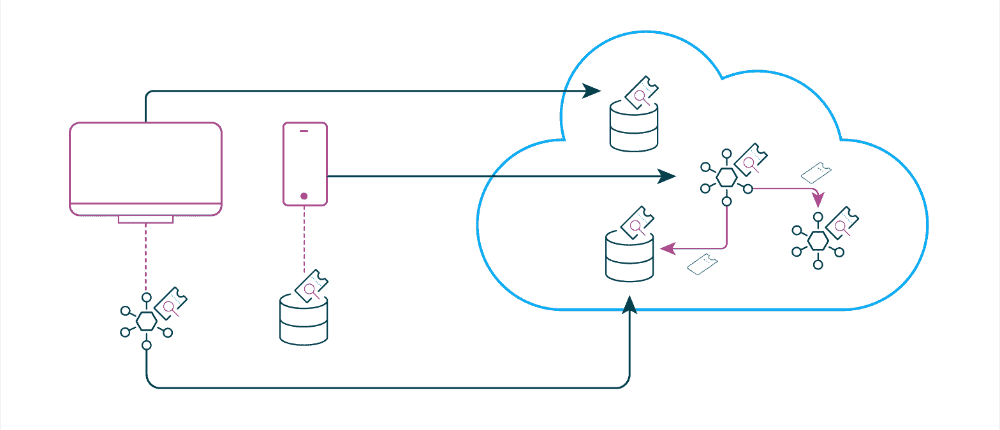

# 零信任:是时候抛弃你的 VPN 了

> 原文：<https://thenewstack.io/zero-trust-time-to-get-rid-of-your-vpn/>

零信任架构(ZTA)的概念已经存在一段时间了。然而，在实践中，零信任实现的速度非常缓慢。也许这并不奇怪，因为全面的 ZTA 是一项大任务，最好的方法是从小处着手，然后再扩展。

[零信任架构](https://thenewstack.io/what-is-zero-trust-architecture/)正在获得越来越多的动力，拜登总统 2021 年 5 月[的行政命令“改善国家网络安全](https://www.whitehouse.gov/briefing-room/presidential-actions/2021/05/12/executive-order-on-improving-the-nations-cybersecurity/)”正在推动联邦政府和私营部门更多地采用。

## 什么是零信任？

 [乔纳斯·伊格博姆

乔纳斯是 Curity 的销售工程总监。他的专长是身份和访问管理，以及特权用户、数据库和应用程序的访问控制解决方案。](https://www.linkedin.com/in/iggbom/) 

旧的 IT 安全边界基本上是一个基于位置的网络。用户要么在网络中，要么有一个 VPN 连接来验证与网络的连接。在很大程度上，这足以访问服务和数据，因为它们不像现在这样在云服务中分布和托管。网络的入口点是控制访问的地方，它定义了边界。

这种架构的缺点是，它对访问网络的任何人以及网络适当控制对服务和数据的访问的能力给予了极大的信任。传统网络很少控制横向移动，这意味着如果黑客获得了网络访问权，他们很可能在服务和数据之间自由移动。

在[零信任架构](https://thenewstack.io/why-cloud-native-systems-demand-a-zero-trust-approach/)中，新的边界取决于身份。每次尝试访问网络时，无论呼叫者来自何方，都会验证其身份。这与精确指定呼叫方可以访问哪些服务和数据的细粒度访问控制规则相结合。这需要一个更复杂的过程来验证身份，这取决于它是针对实际用户还是服务。如今，服务在微服务架构中相互对话，这对于控制同样重要。例如，计费服务需要访问库存服务，但可能不需要访问工资服务。

## 身份至关重要

如果请求者的身份未知，那么对系统和数据应用细粒度的访问控制会变得效率较低，这适用于用户和系统。因此，在迈向 ZTA 的过程中，确立身份至关重要。本质上，这是在任何其他步骤发生之前的一个要求。

[零信任成熟度模型](https://www.cisa.gov/publication/zero-trust-maturity-model)概述了向 ZTA 迁移的两个步骤。第一个是“识别企业中的参与者”，它负责验证特定用户的身份。第二步是“识别企业拥有的资产”，目的是识别服务和设备的身份。

自然，需要身份验证来识别用户并确定他们就是他们所说的那个人。如今，身份验证有无穷无尽的选择，不需要密码的方法也越来越流行。例如， [WebAuthn](https://curity.io/blog/going-passwordless-with-webauthn) 是一个出色的选项，它具有强大的架构，比短信和电子邮件认证选项更能抵御网络钓鱼攻击。

## 基于令牌的体系结构

OAuth 和 OpenID Connect (OIDC)是支持基于令牌的架构的标准，这种模式非常适合 ZTA。事实上，你可以说[零信任架构是基于令牌的架构](https://curity.io/resources/learn/zero-trust-overview/)。

那么，基于令牌的架构是如何工作的呢？首先，它确定用户是谁，或者什么系统或服务正在请求访问。然后，它发布一个访问令牌。令牌本身将包含不同的声明，这取决于所请求的资源以及上下文信息。令牌中给出的声明可以例如由诸如[开放策略代理(OPA)](https://curity.io/resources/learn/opa-integration/) 的策略引擎来确定。策略描述了允许的访问以及访问某些资源需要哪些声明。在访问请求的上下文中，令牌服务可以基于该定义的策略发布具有适当声明的令牌。

被访问的资源需要验证身份。在现代架构中，这通常是某种类型的 API。当收到对 API 的请求时，API 验证随请求一起发送的访问令牌。系统确保访问令牌没有过期，验证令牌具有所需的声明，并确保令牌是由有效的授权服务器(颁发者)颁发的。

此时，基于令牌的体系结构还可以确定用户的类型，是否是访问请求中涉及的用户，以及他们是内部用户还是外部用户。这一过程消除了使用 VPN 的传统方法的需要。服务和 API 可以公开信息，并根据 ZTA 模型，根据用户的身份直接验证用户应该访问什么。

## 结论

实现 ZTA 的第一步是实现总是验证请求者身份的协议，而不管是用户还是另一个服务在请求。对于用户认证，无密码选项越来越受欢迎，这将带来更安全、更无缝的用户体验。

将健壮的身份层与基于令牌的架构相结合，实现灵活且可扩展的模型，允许服务和 API 始终验证谁在请求访问以及应该允许什么级别的访问。

<svg xmlns:xlink="http://www.w3.org/1999/xlink" viewBox="0 0 68 31" version="1.1"><title>Group</title> <desc>Created with Sketch.</desc></svg>