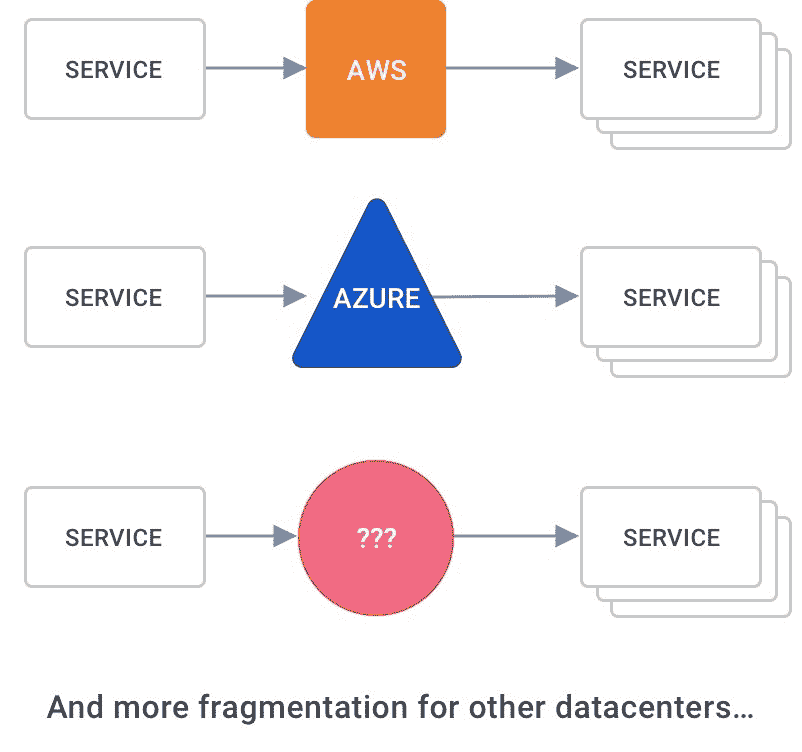

# ZeroLB，一种新的分散式负载平衡模式

> 原文：<https://thenewstack.io/zerolb-a-new-decentralized-pattern-for-load-balancing/>

 [马可·帕拉迪诺

马可·帕拉迪诺是一位发明家、软件开发者和互联网企业家，住在三藩市。作为 Kong 的首席技术官和联合创始人，他是 Kong 的合著者，负责公司产品的设计和交付，同时还在 Kong 和外部软件社区内提供围绕 API 和微服务的技术思想领导。在孔之前，Marco 于 2010 年共同创立了 Mashape，该公司成为最大的 API 市场，并于 2017 年被 RapidAPI 收购。](https://konghq.com/) 

随着[微服务](https://konghq.com/learning-center/microservices/?utm_source=tl&utm_medium=referral&utm_campaign=the-new-stack-zerolb)时代(始于 2013 年和 2014 年 Docker 和 [Kubernetes](https://konghq.com/learning-center/kubernetes/what-is-kubernetes/?utm_source=tl&utm_medium=referral&utm_campaign=the-new-stack-zerolb) 的发布)推动的技术进步，新的架构模式已经出现，可以提供分散的负载平衡，但可以跨各种平台和云进行移植。旧的整体式集中式负载平衡器是一种在 21 世纪初基本上停滞不前的技术，在这个新的分布式世界中已经过时了。

在每个应用程序中部署的最常见的负载平衡器——集中式负载平衡器——是一种遗留技术。它们在我们新的分布式和去中心化的世界里不太好用。集中式负载平衡器是不适应现代最佳实践的单一传统工作方式的残余，它阻止用户和组织有效地过渡到云原生和基于容器的时代。

因为集中式负载平衡器会引入单点故障，所以会导致不必要的网络延迟。他们对上游服务的看法也很简单，因此他们无法为服务提供很多智能、身份和可观察性。此外，它们非常昂贵，而且通常不能跨多个云进行移植。最后，集中式负载平衡器的功能有限，包括缺乏对现代[零信任](https://konghq.com/blog/zero-trust-service-mesh-security/?utm_source=tl&utm_medium=referral&utm_campaign=the-new-stack-zerolb)安全性、跟踪和指标的设置支持，以及跨应用程序的自我修复功能。

在本文中，我将解构这些陈述，并介绍一种新的本地去中心化的负载平衡: **ZeroLB** 架构。

## **集中式负载平衡器的悲哀**

传统的负载平衡器在我们的应用程序中引入了一系列问题，随着我们的应用程序变得越来越分散和分散，这些问题会成倍地恶化。在典型的分散式应用中，集中式负载平衡器会成为我们服务的单点故障:

通过引入集中式负载平衡器，我们还通过在网络中增加一个我们通常不需要的额外跳来提高网络性能:

此外，当我们分离集中式负载平衡器以实现高可用性时，我们通常需要每个服务一个负载平衡器，这增加了我们架构的复杂性，进一步降低了性能，并增加了我们的运营成本:

在公共云上部署时，我们可能会尝试使用他们的本机弹性负载平衡器，这反过来会迅速增加成本，因为它们**非常昂贵**，而且它们不可跨云移植，因此会给跨环境复制这些部署的开发人员或运营商带来不完整的体验:

所有这些限制，同时没有扩展现代服务构建者所需的基线连接功能，如自愈路由、金丝雀发布、[可观察性](https://konghq.com/webinars/observability-with-service-mesh/?utm_source=tl&utm_medium=referral&utm_campaign=the-new-stack-zerolb)、零信任安全等。即使他们找到了实现这一功能的方法，实现通常也是不一致的，并且通常不可移植。

## **ZeroLB:分散负载平衡**

推出 ZeroLB，这是一种用于实现负载平衡功能的新模式，性能更高，实施成本更低，可跨所有云进行移植，专为新的微服务时代而打造。如今，许多组织正在通过客户端负载平衡实现来采用 ZeroLB，并取得了巨大的成功，但更多的组织仍在为其分散式架构寻找集中式负载平衡器。

随着“ZeroLB”术语的引入，我们的目标是以一种清晰简洁的方式传播这种新的负载平衡模式，以增加它在世界范围内的采用，以及更好、更可靠的应用程序。ZeroLB 可以通过定制实现来构建，或者通过采用通用服务网格来构建，该服务网格是可移植的，可以跨我们在[虚拟机和容器](https://konghq.com/blog/moving-app-vm-kubernetes/?utm_source=tl&utm_medium=referral&utm_campaign=the-new-stack-zerolb)以及每个云上的应用来运行，例如[云本地计算基金会](https://cncf.io/?utm_content=inline-mention)的[库马](https://kuma.io/?utm_source=tl&utm_medium=referral&utm_campaign=the-new-stack-zerolb)，它本机支持上述所有内容，利用 Envoy 代理并具有开放治理。

通过利用部署在我们服务旁边的分散式数据平面代理，我们可以在没有任何单点故障的情况下对流量进行负载平衡，而且速度更快，因为我们不再需要跳转到集中式负载平衡器:

我们在服务网格中的核心功能之一是使应用程序连接在虚拟机和容器之间以及在每个云供应商之间“可移植”。ZeroLB 方法标准化了如何在不同的应用程序和环境中实现负载平衡功能。由于这种模式在分散模式下运行(在相同的底层虚拟机或 Pod 上运行)，我们不必为上游服务启动任何云负载平衡器，从而节省了资金:

在提供所有这些基线连接和负载平衡功能的同时，还支持高级(坦率地说，现代)服务连接功能，如自我修复、服务路由、金丝雀释放、健康检查和断路器以及零信任安全:

## 包扎

负载平衡器市场没有随着当今应用环境中发生的大规模架构变化而发展。用户期望的“连接”消费方式已经改变。开发人员希望他们部署的平台能够在多云环境中自然运行。它们需要更低的运营成本和更高的功能。

Service mesh 和 ZeroLB 运营模式为用户提供了一种交付服务的途径，该途径具有更高的敏捷性和功能性，并包装在自助服务消费模式中。这种模式诞生于一个多云世界，在这个世界中，应用程序的可移植性是一个基本要求，而分散式应用程序是一种新常态。

开发人员和运营商不得不管理比以前复杂得多的环境，而这种复杂性的难点往往来自影响现代设计的传统技术选择的挑战。采用 ZeroLB 运营模式可以让团队在“云连接”时代实现最佳连接。

<svg xmlns:xlink="http://www.w3.org/1999/xlink" viewBox="0 0 68 31" version="1.1"><title>Group</title> <desc>Created with Sketch.</desc></svg>