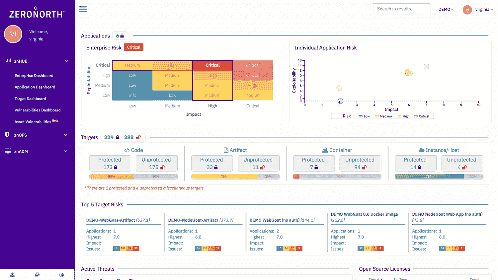
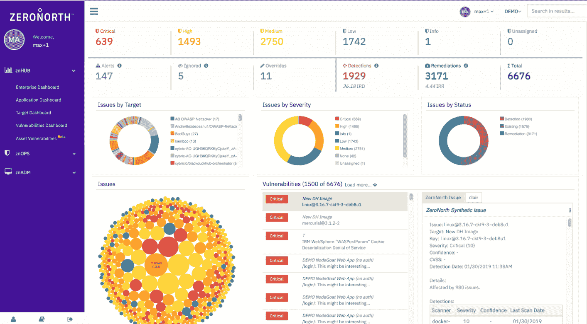
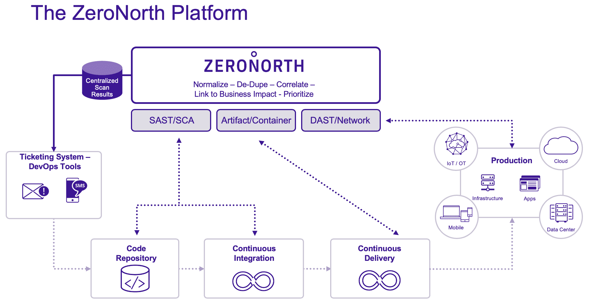
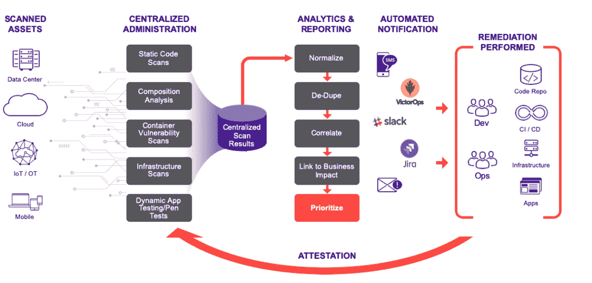

# ZeroNorth:组织所有安全工具的一个基于风险的视图

> 原文：<https://thenewstack.io/zeronorth-one-risk-based-view-for-all-an-organizations-security-tools/>

正如许多公司可以证明的那样，更多的安全工具并不一定意味着更好的安全性。

你会发现关于企业到底使用了多少安全技术的数字各不相同，一些调查显示这个数字在 70 左右，但是来自 Ponemon Institute 和 IBM 的研究指出，高性能的组织已经将他们的工具集精选到“仅仅”39 个。

与此同时，在 [ReliaQuest 对 400 名大型企业安全决策者的调查](https://www.reliaquest.com/resources/vendor-sprawl-survey-report/)中，71%的人表示他们增加安全技术的速度超过了他们有效利用这些技术的速度。69%的人表示，他们的安全团队花在管理这些工具上的时间比防御威胁的时间还多。

为了解决这个问题，总部位于波士顿的 [ZeroNorth](https://www.zeronorth.io/) 提供了一套安全工具，在一个地方提供跨基础设施和应用程序的各种工具的可见性和优先级。

Gartner 分析师 [Dale Gardner](https://www.gartner.com/analyst/62099/Dale-Gardner) 曾[说过](https://www.bugcrowd.com/blog/trust-vulnerability-and-fighter-pilots-key-takeaways-from-the-gartner-security-and-risk-management-summit/)基于风险的漏洞管理类别缺乏对应用程序带来的风险的全面、端到端的了解以及对漏洞的“全面了解”。

### 现有工具的价值

ZeroNorth 创始人 Ernesto DiGiambattista 曾在一家金融集团担任首席技术和安全官，此前曾在一家投资银行公司担任企业审计副总裁。

添加一个新工具意味着添加一个团队来管理这个工具。提供审计报告意味着将所有工具所有者和数据所有者放在一个房间里两个星期，在那里他们将尝试合并来自所有工具的数据，然后尝试找出数据告诉他们什么。但是下一次他需要一份报告的时候，这份报告将与之前的报告完全不一致。他决定要么建立一个系统来整合所有这些信息，要么建立一个公司来做这件事。于是 2015 年 ZeroNorth 诞生了。

“让我们快进到 DevOps 的世界，在那里，开发正在以光速前进，安全和漏洞管理正在使用与 15 年前完全相同的模型。首席执行官约翰·沃拉尔说:“这对任何人来说都是站不住脚的。

“我们是您的扫描工具之上的一层，可以从您现有的扫描工具投资中获得更多价值。我们可以在需要你操作这些工具的等式上花费大量的劳动。”

他指出，各种安全工具产生不同格式的数据。他说，ZeroNorth 自动化了数据标准化和关联的整个过程，所以你实际上可以更好地了解你的风险在告诉你什么。

组织可以查看业务流程，了解与非常具体的业务关键组件相关的应用程序和基础架构风险。

“跨应用程序和基础架构扫描漏洞需要大量不同的工具，单独管理这些工具会变得非常麻烦。手动整合这些工具的输出并确保开发人员能够快速修复问题是非常困难的。

“ZeroNorth 极大地简化了这一过程，集成到现有的开发人员工作流程中，同时优先考虑最具业务风险的问题。最重要的是，我们通过 ZeroNorth 获得的统一视图使得向客户和监管机构提供安全保证变得更加容易，因为我们总是在手边有我们需要的信息，”拍卖技术供应商 [Bidpath](https://www.bidpath.com/) 的首席技术官[弗朗西斯·胡利亚诺](https://www.linkedin.com/in/fmjuliano/)说。

安全团队可能对 DevOps 团队做的最糟糕的事情就是向票务系统发送大量误报。ZeroNorth 可以压缩问题，给开发团队一张更精细的票，告诉他们到底什么必须修复，以及为什么沃拉尔说。

“通常，您会在生产环境中运行一些动态扫描器，可能会显示 500 或 600 个不同的结果。如果我们能把它与一两个不同的软件库联系起来，那么就把它与一个过时的开源库联系起来。因此，我们不是发送 500 或 600 张票，而是创建一张票，我们为开发人员创建一个单一的工作单元，告诉他们，'去修复这个开源库问题。当你解决了这个问题，你也将解决我们附加的其他 500 或 600 个扫描。

“所以我们真的在压缩他们必须处理的项目数量。我们出于合规目的保留了记录，”他说。

该公司坚持认为，这项技术不应该是开发团队所关心的，甚至不应该知道正在运行。

“当我们与 CISOs 谈论我们的解决方案时，他们谈论应用程序开发，DevOps 发展如此之快。他们在自己的环境中没有很多专业知识。因此，他们没有资源与每个业务部门坐下来一起帮助教授…如何设计您的应用程序，以及如何正确执行应用程序安全。”

### 均匀能见度

ZeroNorth 本质上为来自安全工具的数据创建了一个数据湖。

“把我们的平台想象成一个公共总线，你所有的工具都集成到平台中，你所有的应用程序，你所有的仓库，微服务，你的容器，你的生产环境……跨越组织，跨越[软件交付生命周期]”通过 API 连接，沃拉尔说。

利用其相关策略引擎，组织可以自动执行何时运行哪些扫描，并围绕 if/then 方案创建更复杂的策略。

该平台对数据进行标准化、重复数据消除和关联，以便可以分析其业务风险，然后在管理控制台中对漏洞信息进行优先级排序，并通过包括吉拉、VictorOps、文本、电子邮件或 Slack 在内的系统发送警报。

“我喜欢他们平台的一个原因是，它既是组织了解其环境状况的‘入门套件’,也可供部署了多种工具的更成熟的组织使用。TAG Cyber 的高级分析师凯瑟琳·泰特勒告诉新堆栈:“ZeroNorth 配备了几个开源扫描仪，但公司可以将任何其他扫描仪集成到他们的环境中，这使得管理变得容易，可见性变得统一。”。

她指的是[快速启动计划](https://www.zeronorth.io/news/zeronorth-launches-solution-to-jump-start-application-security-initiatives/)，其中包括一套开源工具，包括用于软件组合分析(SCA)的 OWASP 依赖检查(dep Check)；Bandit、Brakeman 和 SonarQube 用于静态应用安全测试(SAST)；Aqua、Clair 和 Docker Content Trust for container security；OWASP Zap 用于已部署 web 应用程序的动态应用程序安全测试(DAST );和 Prowler 来识别云基础架构中配置错误或易受攻击的资产。

该系统还可以并行运行竞争工具，使比较购物更容易。沃拉尔说，用户可以从开源工具开始，然后在它们并行运行时，将它们与商业工具进行比较。

它提供了包括内部检测率(IRD)和内部补救率(IRR)在内的指标，使组织能够定期衡量他们是否在更好、更快、更经济地发现和补救漏洞方面做得更好。

### 为经理提供良好的数据

他说，在这个新兴市场，到目前为止，主要的竞争对手是那些自己已经建立了这种能力的组织。在商业市场，他指出肯纳安全公司(T2)是其最接近的竞争对手，尽管它最初只专注于基础设施，最近增加了应用覆盖面。

“Tenable 或 Veracode 或 Checkmarx 或 Black Duck——它们都有能力与环境集成并扫描环境。他说，我们所做的就是将结果整合到我们的数据湖中，“然后将数据标准化，并提供补救建议。

分配风险是一项业务职能。

“我们的职责是确保我们能够提供所有发现的漏洞的信息，并确保经理和开发人员可以获得真正好的数据，因为他们试图了解首先要做什么。真正关键和独特的是，我们能够让组织将 it 与其业务组件联系起来。”他说，实现治理是客户的一大优势。

“诸如漏洞管理之类的安全基础问题已经困扰了组织几十年，”ClearSky 的合伙人兼首席信息安全官帕特里克·海姆(Patrick Heim 在谈到其在 ZeroNorth 的投资时说。“我们将 DevOps 的采用视为从根本上转变基础设施安全的机会，并将 ZeroNorth 视为可持续和风险驱动的漏洞管理的核心。”

专题图片:[克里斯多佛·米歇尔](https://www.flickr.com/photos/cmichel67/)的《北极破冰之旅》。根据 [CC BY-SA 2.0](https://creativecommons.org/licenses/by/2.0/) 授权。

<svg xmlns:xlink="http://www.w3.org/1999/xlink" viewBox="0 0 68 31" version="1.1"><title>Group</title> <desc>Created with Sketch.</desc></svg>