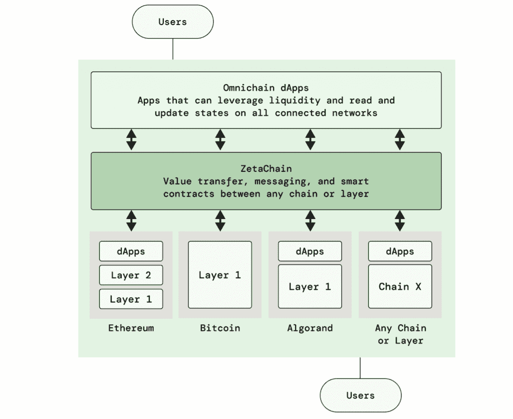

# ZetaChain 提供无桥区块链互联

> 原文：<https://thenewstack.io/zetachain-offers-bridgeless-blockchain-interconnectivity/>

分散式应用程序(dApp)开发的一个基本挑战是单个区块链在设计上不具有互操作性。如果您想发布一个跨越区块链的应用程序，或者利用仅在另一个区块链上可用的功能，标准的解决方法是包装令牌，并利用类似桥的虫洞在两个不同的区块链之间传递这些令牌的值。根据两个区块链的相对市值和涉及的包装令牌的数量，这些桥为寻求利用安全缺陷的不良行为者创造了理想的攻击媒介，我在以前的[文章](https://thenewstack.io/security-risks-facing-web3-developers/)中详细介绍了这一点。

在最近发布的[白皮书](https://www.zetachain.com/whitepaper.pdf)中， [ZetaChain](https://www.zetachain.com/) 提出了一种不同的方法来应对区块链互操作性的挑战，通过创建一个公共的 L1(第一层)区块链，专门用于不可诊断地连接区块链。它这样做是为了促进互操作性，再加上这个 L1 区块链的通用智能合同，可以持有和操纵外部区块链上的资产。

## ZetaChain 是如何工作的？

当涉及到参与多个区块链时，dApp 开发的一个常见方法是为每个链构建一个应用程序。这有可能使维护变得相当不切实际，特别是当大量使用的区块链数量持续增长时。ZetaChain 提出，应用程序开发者可以创建一个单一的“全链”应用程序，通过 ZetaChain 与所有其他区块链连接。来自白皮书的下图提供了一个可能的示例。

在对新堆栈的采访中，ZetaChain 贡献者要求保持匿名，其中一名主要贡献者说:“有了这种新的范式，可能会有这样一个世界，你在 ZetaChain 上部署一个智能合同，然后它在所有链上工作，所以应用程序开发人员不必在以太坊、Polygon 和 Solana 上部署 dApp。你可以在所有相连的链条上利用流动性——我们充当了一个元层。”

总的想法是，不需要在每个链上部署 dApp 和附带的智能合约，而是向现有的智能合约添加一些额外的功能，ZetaChain 解锁他们称为 omnichain-dApp (odApp)的功能。

## 这和宇宙有什么不同？

当我阅读白皮书时，ZetaChain 听起来似乎与 [Cosmos](https://cosmos.network/) 提出的互联区块链愿景有相似之处。我之前报道过 Cosmos 讨论他们通过这些相互关联的区块链来实现[共享安全](https://thenewstack.io/shared-security-for-interconnected-blockchains/)的方法。

在与来自 ZetaChain 的团队交谈时，主要贡献者之一解释说，“如果你想成为宇宙生态系统的一部分，你必须说 IBC 语，”这是区块链之间的通信协议。ZetaChain 的代表进一步解释说，“zeta chain 可以支持任何智能合同区块链。我们还支持使用门限签名方案(TSS)的非智能合约链，如比特币、Dogecoin、[和]莱特币。”

简而言之，ZetaChain 的目标是成为一个与任何区块链交互的协议无关层，而 Cosmos 有一个与任何兼容的区块链交互的特定协议。控制比特币上的资产的能力似乎可能会引起金融服务业的兴趣，在这种情况下，你可以在一个区块链上签订一份智能合约，控制一定数量的比特币。

## 安全呢？

从理论上讲，ZetaChain 解决了困扰桥接的核心问题之一，它消除了被包裹在货币中的储值，这些货币可能成为无限铸造骗局的受害者，如 3 亿美元的虫洞漏洞，该漏洞甚至在主流金融媒体如[美国消费者新闻与商业频道](https://www.cnbc.com/2022/02/02/320-million-stolen-from-wormhole-bridge-linking-solana-and-ethereum.html)中引起了注意。在 ZetaChain 方法中没有包装好的货币等待被偷。

他们似乎也考虑到了 51%的攻击风险(在上面链接的共享安全文章中有更详细的解释),并制定了智能合同来控制 ZetaChain 的供应。

不太清楚的是，ZetaChain 将如何在其充当中介的模式中建立信任。在他们的模型中，你需要相信你建立 dApp 的区块链，你正在连接的区块链，以及作为中间层的 ZetaChain。

当我最初被要求保持 ZetaChain 团队的匿名时，我的第一反应是他们一定在不择手段地搞些什么。见过他们之后，我不再怀疑这是事实，他们似乎有其他理由留在幕后。这也增加了他们从比特币基地和币安背后的一些关键人物那里获得资金的可信度。我确实认为这是正在建设 Web3 的决策者需要思维模式转变的领域之一，因为我们大多数人都想知道谁是我们花费 IT 预算的技术背后的人。

<svg xmlns:xlink="http://www.w3.org/1999/xlink" viewBox="0 0 68 31" version="1.1"><title>Group</title> <desc>Created with Sketch.</desc></svg>