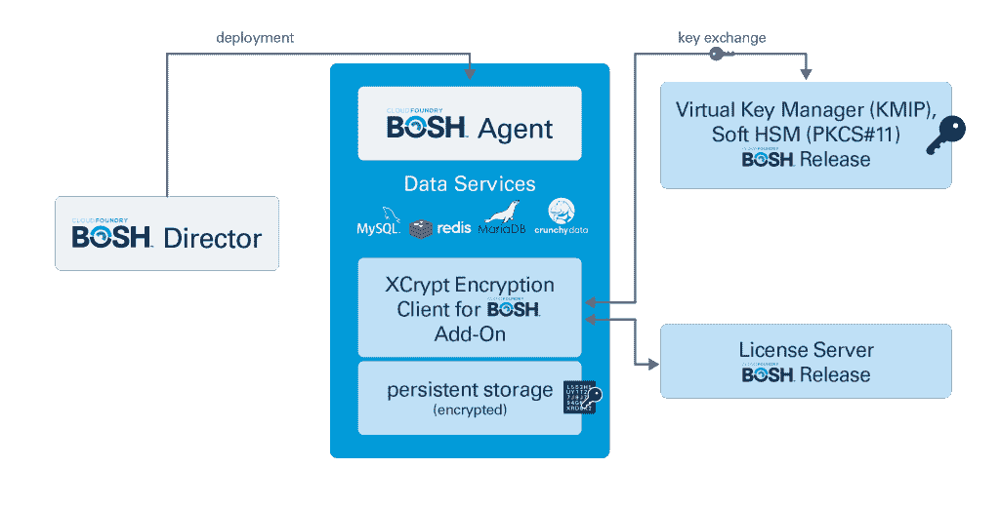

# Zettaset 为 Cloud Foundry 推出软件定义的加密

> 原文：<https://thenewstack.io/zettaset-launches-software-defined-encryption-for-cloud-foundry/>

当您考虑保护容器时，可以考虑使用轻量级虚拟机将它们隔离在多租户环境中。或者，您可能希望使用 Istio 在所有容器内通信中获得 mTLS 的好处。或者您可以使用不同的供应商来执行取证，并确保容器不会更改数据或运行不应该运行的流程。然而，在某些方面，Zettaset 采取了一种不同的、更基本的方法——他们对数据进行加密，因此，即使发生了破坏，数据对攻击者来说也是毫无价值的。

本周在费城举行的 [Cloud Foundry 峰会](https://www.cloudfoundry.org/event/nasummit2019/)上，Zettaset 发布了[XCrypt Service Encryption for Cloud Foundry](https://www.cloudfoundry.org/the-foundry/xcrypt-archive-for-cf/)，为 Cloud Foundry 和 BOSH 部署带来了其软件定义的加密技术。CEO [Jim Vogt](https://www.linkedin.com/in/jim-vogt-a57309/) 解释说，这种新方法是专为分布式系统和弹性云环境中的最佳性能和可扩展性而设计的。

“旧的集中式加密模型粒度太细，产生太多延迟，而且根本无法扩展。根据当今组织的需求，它们不再可行，”Vogt 在一份公司声明中说。“Zettaset 已着手解决这一市场需求，为新的‘点击式’加密技术申请专利，该技术包括基于软件的密钥管理、行政和许可，以最大限度地发挥分布式环境的创新潜力。”

虽然 Zettaset 专注于将其技术引入最新的软件应用架构，但他表示，这仍然可以归结为保护物理设备上的数据，无论这个过程有多抽象。

Vogt 在一次采访中说:“随着你越来越深入虚拟环境，以及人们正在建立基础和实例并需要保护他们正在处理的数据的环境，你根本无法用集中式或基于设备的模式做到这一点。“所有虚拟环境，包括容器，都会找到一个物理设备。因此，如果您正在设置一个容器或者您正在设置一个 Cloud Foundry 实例，这些数据将被存储在某个物理位置。最突出的威胁仍然是数据的物理窃取。当您不使用数据时，您希望确保它被固定和加密。当您使用数据时，如果您在容器或节点之间传输数据，或者不管是什么情况，您都希望确保数据也是加密的。”

XCrypt 服务加密对部署数据服务的卷进行加密，以保持性能，并与任何数据服务配合使用，包括 Greenplum、Redis、Crunchy Data、MariaDB 等。XCrypt 服务包括 BOSH add-on 以及 BOSH release 许可证和密钥管理器，根据该公司的声明，“自动管理保护和控制对业务关键加密密钥的访问的策略，从而弥合管理加密密钥的手动、不安全方式与具有大量选项和设置的复杂密钥管理系统之间的差距”。

当被问及 Zettaset 是否会很快加入 Kubernetes 的部署时，Vogt 笑着给出了以下回答。

“我想说的是保持关注，”沃格特说。“每个人都在向集装箱发展，我们基本上也在朝这个方向前进。他们越来越虚拟化。我们越来越虚拟化。”

Cloud Foundry 基金会是新堆栈的赞助商。

专题图片:Zettaset 工程总监 Maksum Yankovsky(左)和 Zettaset 副总裁兼营销 Jeff Harrell 在 Cloud Foundry 峰会上。

<svg xmlns:xlink="http://www.w3.org/1999/xlink" viewBox="0 0 68 31" version="1.1"><title>Group</title> <desc>Created with Sketch.</desc></svg>