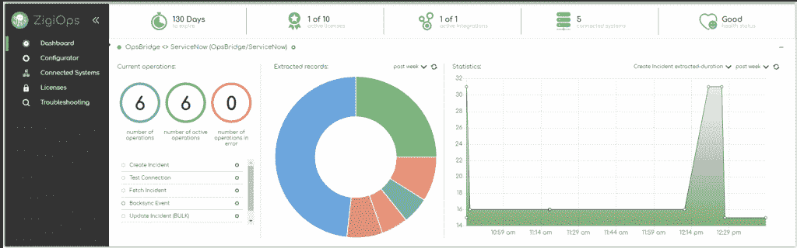

# ZigiWave 采用了一种无代码的集成方式

> 原文：<https://thenewstack.io/zigiwave-takes-a-no-code-approach-to-integration/>

传统上，创建集成意味着 IT 领导必须拿出预算，然后组建开发人员和项目经理团队。即使对于一个小项目，这也可能需要几个月的时间。

Idan Harel 和 [Avi Koren](https://www.linkedin.com/in/avi-koren-vaknin-ab9466228/?originalSubdomain=il) 在技术咨询公司 Do it Wise 工作时看到了这种模式，因为客户不断要求各种集成，而不是自己完成工作。

“我们有许多供应商创建非常具体的集成，但一旦客户想要改变它们或根据他们的需求定制它们，就很难找到一个，”Koren 说。

而且，IT 主管常常甚至不知道这样一个项目的预算是多少。

“我们决定，我们需要创建一个非常简单的集成平台，”他说。“这应该不需要几个月；应该不会超过几分钟。”

因此，哈雷尔和科伦推出了 [ZigiWave](https://zigiwave.com/) ，这是一家位于保加利亚索非亚的初创公司，它提供了一个无代码平台，用于集成一些最流行的[监控](https://thenewstack.io/category/monitoring/)、IT 服务管理(ITSM)和 [DevOps](https://thenewstack.io/category/devops/) 工具。而且不是针对开发者，而是针对他们的管理者。

“如果一个经理想要整合，他们不需要有这种麻烦来创建一个团队，”科伦说。

他说，你只需定义你想要什么，“几分钟后，你就可以马上得到它”。“你只需要把需求放进我们的系统，不需要任何编码，它就会工作。”

## 实时同步

核心产品是集成引擎 ZigiOps，用 Java 和 Clojure 编写。它使用户能够完全从用户界面管理[集成](https://zigiwave.com/system-integrations/)。在此基础上，他们可以通过实时数据同步创建双向集成，并通过高级数据映射和过滤捕获复杂的数据依赖关系。此外，用户可以随时更改任何参数。

[https://www.youtube.com/embed/euZRq9H5zs0?start=7&feature=oembed](https://www.youtube.com/embed/euZRq9H5zs0?start=7&feature=oembed)

视频

ZigiOps 旨在通过提供对相应 API 支持的所有可用 CRUD 操作的访问，与目标系统的 API 及其相关软件组件无缝连接。它处理复杂的 HTTP 请求，这些请求旨在匹配已配置的集成用例。

ZigiOps 还为 30 多个应用程序提供集成[模板](https://docs.zigiwave.com/zigiops/Available-Templates.23331062.html)，包括吉拉、 [ServiceNow](https://www.servicenow.com/?utm_content=inline-mention) 、Azure DevOps、 [BMC](https://www.bmc.com/?utm_content=inline-mention) 、Salesforce 等等。

Koren 说，ZigiWave 的集成工程师成为他们处理的每个系统的专家，因此客户不必为了创建集成而知道每个系统的所有细节。该公司坚持认为，客户没有必要钻研底层代码，因为所有这些都可以通过用户界面进行管理和定制。他说，这种互动是业务层面的，而不是 API 或技术层面的。

Koren 说，它的无代码方法和对易用性的关注是 ZigiWave 从包括 Boomi、Workato 和其他人在内的大量集成提供商中脱颖而出的方式。

首先，系统检测与特定系统相关的[数据](https://thenewstack.io/category/data/)。一些客户使用现成类型的数据，但其他具有更复杂系统的客户，如 Salesforce 和 ServiceNow，也能够创建自定义数据。

一旦用户定义了集成，该技术就会获取需求并构建一个通过 API 执行集成的计划。

“大多数系统都有一个基于 HTTP 的 API，如果是 REST API，或者 SOAP 或类似的东西，”Koren 说。“当然，许多其他公司也有 Java API。那些没有 Java API 的，有 C 或 C++ API。我们使用不同的库，[所以]它知道如何在 Java 和特定语言之间架起桥梁。”

他说，如果系统有特定的限制，比如每分钟只能处理 10，000 个事件，引擎可以调整，以便目标系统能够消化它。

通过同步 ITSM 工具，用户只需点击几下鼠标，即可自动处理突发事件、事件、变更请求等。它还通过 Micro Focus OpsBridge、 [New Relic](http://newrelic.com/?utm_content=inline-mention) 、Datadog、Prometheus 等集成提供对 It 基础架构和应用性能的监控。

## 扩展 DevOps 产品

Koren 说，该公司拥有 60 多家财富 500 强公司的客户，其中约 60%的客户在美国。它们包括通用汽车、联邦快递、德尔塔牙科和纳斯达克。

“ZigiOps 是一个强大且易于使用的集成平台。它帮助我们毫不费力地连接了吉拉和 ServiceNow，现在我们可以在两个平台之间实时同步任务和事件。这加快了事件解决和票证管理的速度，并通过减少管理任务来帮助我们提高效率，”澳大利亚物业转让解决方案提供商 PEXA 的企业服务总经理 Aaron Geiss 说。

去年 6 月，ZigiWave 推出了[嵌入式集成中心](https://zigiwave.com/embedded-integration-hub/)，这使得企业能够采用并重塑 ZigiOps 集成平台，将其作为一项服务提供给自己的客户。

11 月，除了内部版本之外，它还推出了云产品。

虽然它提供了与 DevOps tools 吉拉和 Azure DevOps 的集成，但它仍在努力将 Jenkins、GitHub、Bitbucket 和 Confluence 添加到其阵容中。Koren 说，展望未来，ZigiWave 的目标是扩大其 DevOps 和 [CI/CD](https://thenewstack.io/category/ci-cd/) 产品以及云集成。

它的路线图还要求创建一个集成向导和更多围绕集成工作流的功能。

<svg xmlns:xlink="http://www.w3.org/1999/xlink" viewBox="0 0 68 31" version="1.1"><title>Group</title> <desc>Created with Sketch.</desc></svg>