# ZStack，一个具有进程内微服务架构的基础设施软件

> 原文：<https://thenewstack.io/zstack-an-infrastructure-software-with-an-in-process-microservices-architecture/>

编者按:开发云服务是出了名的复杂。张腾飞正在寻求用 ZStack 简化 IaaS 环境的开发，这是一个开源项目，它的设计原则是简单性、可伸缩性和可扩展性。有一个开源项目，想解释一下？在新书库寄给我们，我们会考虑出版。

[ZStack](http://zstack.org/) 是一款开源的 IaaS(基础设施即服务)软件，旨在通过 API 实现数据中心自动化并管理计算、存储和网络资源。它旨在解决阻碍企业在架构设计中采用私有云的障碍。简单性、稳定性、可伸缩性和可扩展性是 ZStack 架构设计的主要关注点，从一开始就被考虑在内。

ZStack 使用所谓的进程内微服务架构将所有服务包含在单个进程中。部署 ZStack 管理节点实际上是将标准的 Java WAR 文件部署到 web servlet 容器中，这是遵循 Java 规范的一项众所周知的技术。ZStack 对 Linux 操作系统只有很少的外部依赖，包括 MySQL、RabbitMQ 和 [Ansible](http://www.ansible.com/home) ，这些都是每个 Linux 厂商分发的。用户可以将单个节点管理节点设置为:

[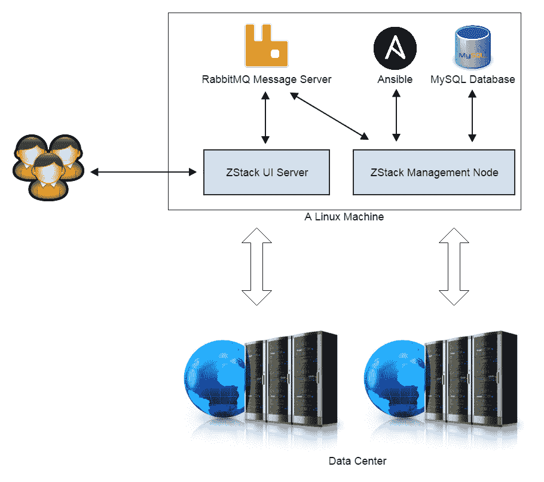](https://thenewstack.io/wp-content/uploads/2015/04/1.png)

对于需要高可用性(HA)和横向扩展的生产环境，用户可以将 MySQL 和 RabbitMQ 移动到不同的机器上，并将单一管理扩展到多个管理节点:

[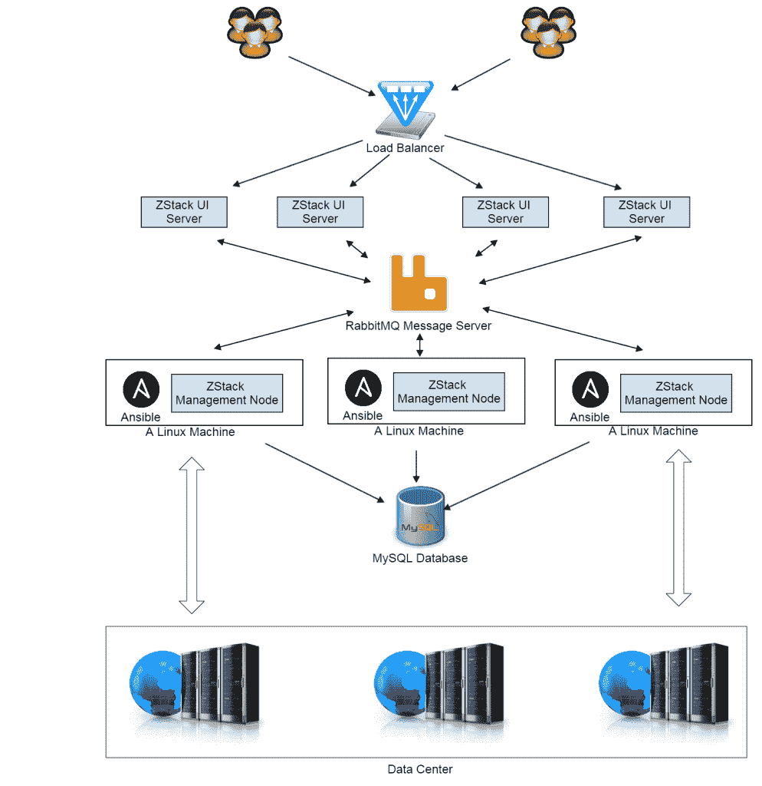](https://thenewstack.io/wp-content/uploads/2015/04/2.png)

由于数据中心通常管理大量外部设备(例如，物理服务器、存储设备)，因此通常需要在设备上安装代理。ZStack 集成了 Ansible，使部署代理的过程完全自动化，而不是要求用户手动完成，这可能会令人厌烦和畏惧。比如用户在 ZStack 中添加一个 KVM 主机时，需要在物理服务器上安装一个 KVM 代理以及依赖包，包括 qemu-kvm、libvirt、qemu-utils、iptables 等等；AddKvmHost API 会触发 ZStack 调用 Ansible 自动完成任务。KVM 的可回答的 YAML 文件的截图如下所示:

[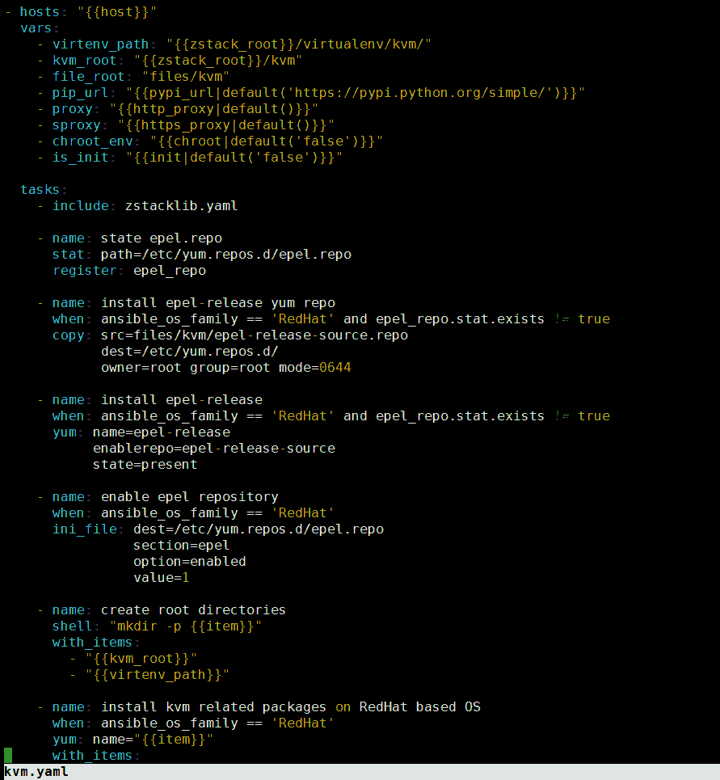](https://thenewstack.io/wp-content/uploads/2015/04/3.png)

高级用户可以扩展 YAML 文件以添加他们的包来执行维护任务；例如，对所有 KVM 主机应用关键的安全补丁。YAML 配置和代理都存储在 Java WAR 文件中，ZStack 通过 Java 类路径找到它们。这个过程对用户来说是透明的，他们甚至不会注意到代理的存在。

ZStack 监控资源(虚拟资源和物理资源)的健康状况。管理员可以通过 web 用户界面观察状态变化，例如，观察主机连接状态、虚拟机状态、物理存储连接。一旦资源的状态发生变化，比如说虚拟机意外停止，ZStack 可以在可配置的时间间隔内检测到，并将实际状态同步到数据库中。ZStack 还通过 Java JMX 协议公开管理节点的内部状态。管理员可以查看各种事件的统计数据，包括当前正在运行的任务、正在处理的消息、消息的最大处理时间、消息的平均处理时间、累积的任务等，以确定他们是否需要添加额外的管理节点来分担系统工作负载。

全面的查询 API 是 ZStack 为帮助管理大量资源而引入的另一项创新。用户可以通过 API 执行类似 SQL 的查询，而无需直接接触底层数据库。ZStack 提供了超过四百万个单一查询条件和无数个组合查询条件。只要数据库表有相互链接的外键，用户就可以执行跨多个表的查询；例如，查询包含具有 EIP 16.16.16.16 的虚拟机的区域。ZStack 解析查询 API，自动生成单表查询和多表连接。用户不用查用户手册，就可以按任何字段查询每个资源；ZStack 的命令行工具(CLI)提供了自动完成功能，提醒您可查询的字段和可连接的资源。

[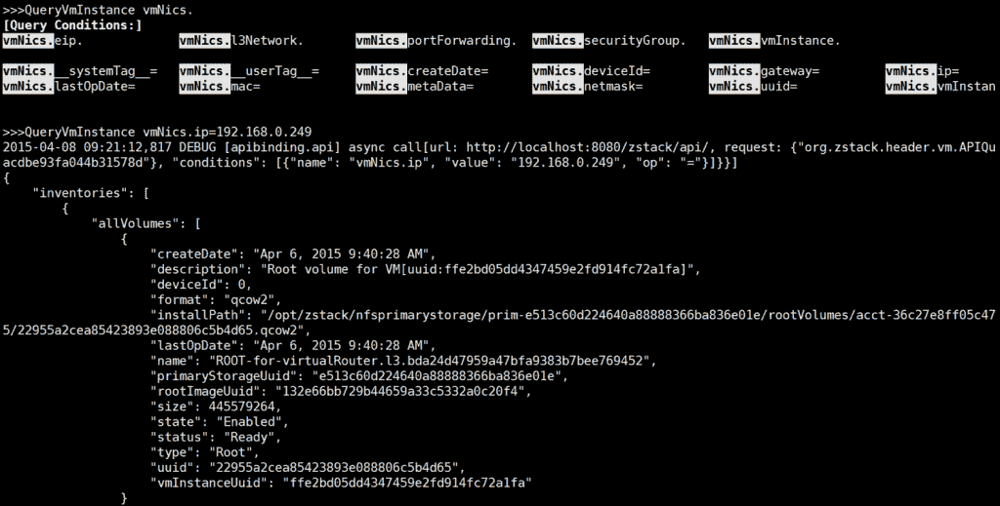](https://thenewstack.io/wp-content/uploads/2015/04/4.png)

在未来，ZStack 将提供类似于 Outlook 和 JIRA 的企业级用户界面，允许用户基于查询 API 创建各种视图，例如，显示同一 L3 网络上所有虚拟机运行状态的视图。

## 稳定性

作为集成软件，IaaS 通常需要管理复杂的子系统，包括计算、存储和网络。任务的执行路径通常很长，任何子系统都可能出错。因为现有的 IaaS 软件缺乏在错误时回滚所应用的操作的机制，所以子系统通常处于中间状态，这可能导致未来任务的失败。例如，如果虚拟机无法在虚拟机管理程序上启动，其网络信息可能会留在网络节点中。通过配备工作流引擎，ZStack 可以在发生错误时回滚所有以前应用的操作。

[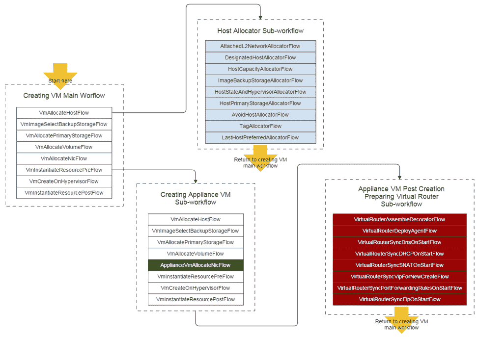](https://thenewstack.io/wp-content/uploads/2015/04/5.png)

上图显示了创建用户虚拟机的工作流程。如果发生错误，比如 VmCreateOnHypervisorFlow 失败，工作流引擎将回滚所有六个先前的流，包括它们的子流，通过返回计算能力、销毁虚拟网络节点、删除磁盘卷和释放 IP 地址来恢复操作。

除了回滚，工作流引擎还提供了一种配置关键任务执行路径的方法。在上面的示例中，创建虚拟网络节点的过程与创建用户虚拟机几乎相同，因此 ZStack 重用了创建用户虚拟机的大部分流程，只是通过编辑流配置的 XML 文件，用流 ApplianceVMAllocateNicFlow(用绿色标记)替换了分配虚拟网卡的流程。

[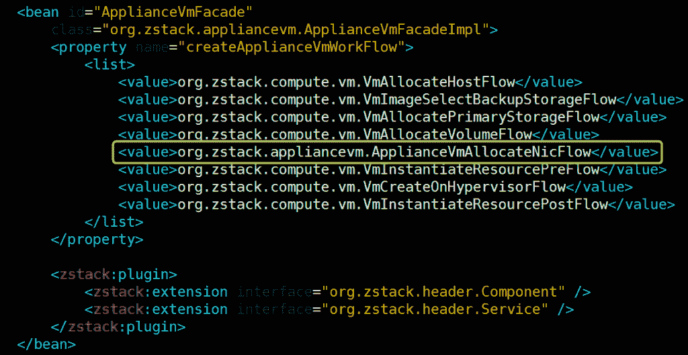](https://thenewstack.io/wp-content/uploads/2015/04/6.png)

类似于 [Eclipse](https://eclipse.org/) 和 Java OSGI 的通用插件系统是 ZStack 区别于当前其他 IaaS 软件的另一个架构设计。所有 ZStack 组件都是作为小插件构建的，这保证了添加或删除功能不会影响软件的稳定性。插件系统的主干是扩展点，它允许组件挂钩到其他组件的执行路径。每个组件都可以通过向其他组件公开挂钩接口来定义自己的扩展点。

【T2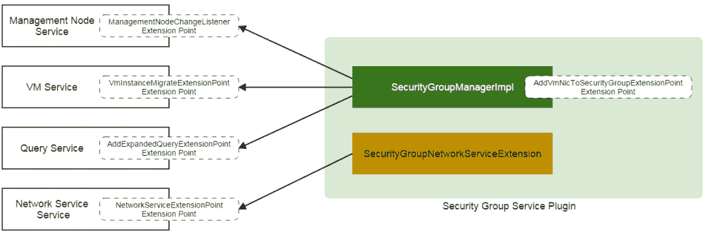

上图是安全组实现的概述，它需要与虚拟机的生命周期挂钩，以在虚拟机管理程序中编写防火墙规则。对于虚拟机，防火墙规则是一个附加功能，不应在其自身的业务逻辑中实现，因此安全组在一个独立的插件中实现，挂钩到管理节点服务、虚拟机服务、查询服务和网络服务提供的各种扩展点。即使用户通过删除其 JAR 文件和配置文件来移除该插件，也不会影响整个系统，但会导致安全组的丢失。

标签，也称为标签，在软件中非常常见。除了帮助用户分组资源的标签的正常使用，ZStack 定义了所谓的系统标签，允许插件在不改变数据库的情况下向资源添加额外的信息。例如，虚拟机的数据库表没有名为 hostname 的列；一个插件定义了一个系统标签“hostname::{hostname}”，允许用户创建带有主机名的虚拟机，并随时更改主机名。系统标签本质上是独立数据库表中的键值对；插件可以为资源定义任何属性，而不会损害它们的数据库模式，从而降低升级 ZStack 时数据库迁移的风险。

可配置的工作流引擎、插件系统和系统标签的目的是松散地解耦整个架构，允许开发人员在保持软件稳定的同时快速添加新功能，避免频繁重构现有代码带来的不稳定性。

ZStack 是以测试驱动开发(TDD)的方式开发的。有三个严格的测试系统:集成测试系统、系统测试系统和基于模型的测试系统来保护每一个特性。集成测试系统使用模拟器来验证管理节点的业务逻辑；系统测试系统测试真实硬件环境中的场景。基于模型的测试系统是最令人兴奋的部分，它可以通过使用不同的算法(例如，随机、权重驱动、历史驱动)排列 API 来生成测试用例，测试正常使用中很少发生的角落用例。因为基于模型的测试系统可能会运行几天，调用数千个 API，所以当发现缺陷时很难调试。为了避免不得不手动重现缺陷，ZStack 提供了一个工具，可以读取日志来生成测试用例，重放测试程序，帮助开发人员重建失败环境。

[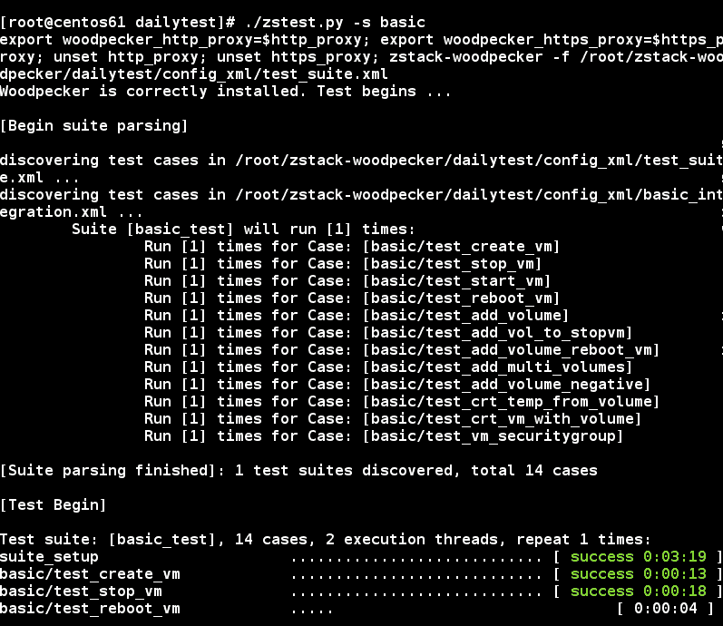](https://thenewstack.io/wp-content/uploads/2015/04/8.png)

## 可量测性

ZStack 是唯一一款号称可以管理几十万台物理服务器和几百万台虚拟机，由单个管理节点服务几万个并发 API 的 IaaS 软件。借助模拟器，ZStack 通过了管理十万台主机和通过 10，000 和 30，000 个并发 API 请求创建一百万个虚拟机的压力测试。在 ZStack 中创建虚拟机速度极快，以下是性能数据:

测试是在真实的虚拟机和模拟器上进行的，只使用了一个虚拟网络节点。在测试中，在 DHCP/DNS 软件— Dnsmasq 上观察到性能瓶颈。通过使用 inotify 的补丁 Dnsmasq，创建 10，000 个虚拟机的时间甚至可以提高到 11 分钟！

ZStack 高可伸缩性的秘密包括三种架构设计:异步架构、无状态服务架构和无锁架构。

异步架构确保任务以异步方式从 API 执行到设备上的代理，这保证了没有线程在等待任务完成时被阻塞，因此具有 1，000 个线程的线程池可以轻松处理 10，000 个并发 API。异步架构由三部分组成:异步消息、异步方法调用和异步 HTTP 调用。微服务使用异步消息进行相互通信；微服务内部的组件使用异步方法调用；异步 HTTP 调用用于外部设备上的微服务和代理之间的通信。它们的互操作概述如下:

[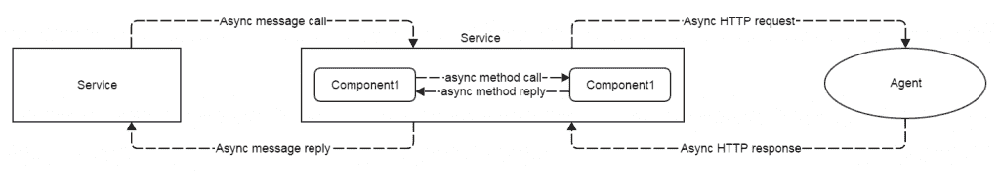](https://thenewstack.io/wp-content/uploads/2015/04/9.png)

无状态服务架构使用一致的哈希环将消息分发到多节点环境中的不同服务实例。之所以称之为无状态，是因为服务实例不需要相互交换关于它们管理的资源的信息，并且发送消息的服务不需要知道谁将为这些消息提供服务；状态从服务解耦到一致的散列环中。

[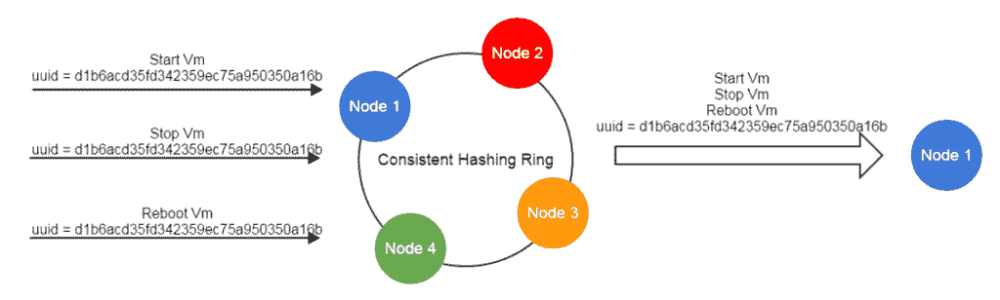](https://thenewstack.io/wp-content/uploads/2015/04/10.png)

使用无状态服务架构，包含 100 个节点的多节点环境与包含两个节点的环境一样稳定。添加或删除节点不会影响系统的稳定性。

由于无状态服务架构，ZStack 不使用任何锁来控制资源竞争，而是将操作与队列同步，因为对同一资源的操作将总是被路由到同一服务实例。ZStack 的队列是并行度从 1 到 n 的 FIFO 队列，只同步执行操作的资源使用并行度等于 1 的队列:

[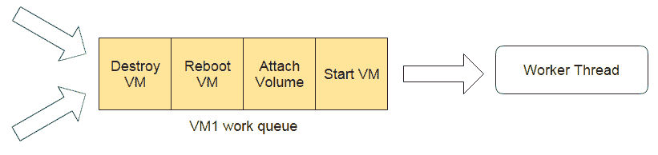](https://thenewstack.io/wp-content/uploads/2015/04/11.png)

可以并行执行操作的资源使用并行级别为 N 的队列:

[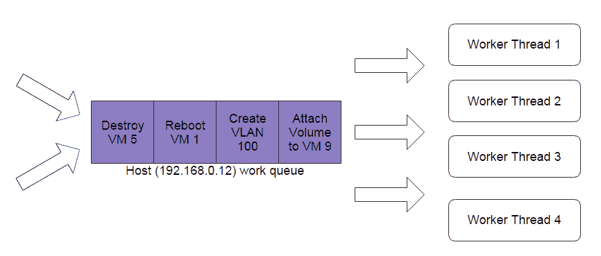](https://thenewstack.io/wp-content/uploads/2015/04/12.png)

关键资源的并行级别可以通过 UI 由全局设置来配置。例如，用户可以将 KVM 主机配置为最多同时执行 10 个操作。

## 展开性

在可伸缩性一章中，我们介绍了工作流引擎、插件系统和系统标签，尽管增加了新的功能，它们仍然保持 ZStack 编排的稳定性。它们也是可扩展性的关键。ZStack 的编排服务只提供管理计算、存储和网络的核心 API。开发人员可以创建各种插件来提供高级 API，以满足用户的需求。例如，ZStack 的快照 API 只允许用户创建、恢复和备份快照；没有用于定期计划任务、创建和备份快照的 API。这种特性可以作为一个插件来实现，该插件提供类似 cron-job 的 API，并调用快照 API 来执行创建和备份快照的活动。

除了进程内插件，ZStack 还提供了一种为与核心编排服务没有紧密绑定的特性创建进程外插件的方法。例如，通过监听消息总线上公开的规范事件，可以完全在进程外构建计费系统。ZStack web UI 是进程外插件的一个典型例子。需要访问数据库和编排服务的内部数据结构的插件可以构建为一个半进程外插件，其中有一个小的进程内组件通过消息总线向进程外组件发送数据:

[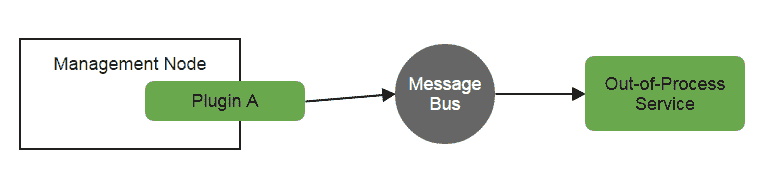](https://thenewstack.io/wp-content/uploads/2015/04/13.png)

作者张腾飞于 2006 年加入英特尔 OTC(开源技术中心),致力于 XEN 虚拟机管理程序，贡献了多个功能，如 XEN E100 网卡仿真器、XEN/IA64 来宾 BIOS 的 Windows 支持以及许多错误修复。2010 年，张腾飞加入 Cloud.com(被 Citrix 收购)，从事 CloudStack 的工作。离开 Citrix 后，Frank 和他的合作伙伴创建了新的开源 IaaS 项目——z stack。

特色图片[通过](https://www.flickr.com/photos/ajari/5230541178/in/photolist-8YcTEs-76FgTa-6LPvQD-6eKMHg-fDFv2W-axXQuk-74u4KV-fDFuAW-76FfAv-jCSeA3-9BdWcN-eVjPpf-22DGJ-fL1LXr-bavYVM-8k7Ui5-3iX3bc-GuFZk-9mN64L-fjmB3y-7xzmMc-76FiTz-cVQqTS-f8xASn-dSmaj5-kHghwK-5hYKDT-ejuFAM-eU6WWN-7ftXmg-bZoERo-8oeXD5-fDoVfr-pQBm67-9yGXaa-4ygmop-qysKri-rjRrT3-nwzeNt-iZPp7q-9HXNEa-6WTX4-4LSKfX-8b1RFn-rjmrsZ-oAM2Ko-8VR2kP-mzQz6-4QpfGy-ffLDch) Flickr 知识共享。

<svg xmlns:xlink="http://www.w3.org/1999/xlink" viewBox="0 0 68 31" version="1.1"><title>Group</title> <desc>Created with Sketch.</desc></svg>