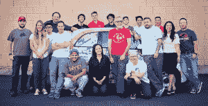
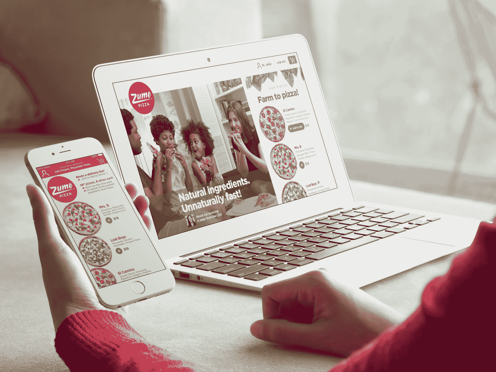
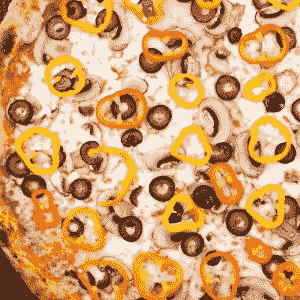

# Zume 用自动烤箱测试比萨饼送货车，以获得更新鲜的送货

> 原文：<https://thenewstack.io/zume-upgrades-pizza-delivery-trucks-automated-ovens/>

一家雄心勃勃的硅谷初创公司正在使用自动化来改善食品配送——它从一些美味和创新的披萨开始。该公司还对人类在我们自动化辅助的世界中的作用进行了一些认真的思考——更不用说我们如何获得食物的改进了。

亚历克斯·加登有视频游戏的背景:他是 Zynga 工作室的前总裁，也是微软 Xbox Live 的总经理。根据来自彭博的报道，2015 年 6 月，他在“秘密情绪”中推出了他的食品配送初创公司 Zume，在硅谷一个没有标记的车库里制造卡车。到 10 月份，该公司已经召集了一批工程师——机械、电气和软件——与瑞士机器人公司 ABB 合作。Zume 的内部工匠建造了他们需要的任何东西——从电路板到他们用甘蔗纤维制造的带有防潮湿草皮的特别设计的盒子。

最终，一切都走到了一起。Zume 的(专利)运输卡车每个都有 56 个烤箱，每个都可以远程点火。Zume 的卡车甚至配备了处理交通数据的软件，以计算他们的预计到达时间(使用机器学习算法)。它配备了全球定位系统，这意味着顾客也可以实时跟踪他们的比萨饼的位置。

## 最小化停留时间

据彭博称，去年 4 月，“这家初创公司向山景城的一位不知情的顾客出售了第一个机器人制造的馅饼。”根据 Quartz 的数据，到 1 月份，该公司每天卖出 200 个比萨饼，该公司补充道，“即使在午餐高峰期间，工作的程序员也比厨房工作人员多。”Fast Company Design 称这一系统对于销售的少量披萨来说是“完全多余的”,但今年 Zume 希望通过扩展到湾区，并最终扩展到洛杉矶，每天可以生产 2500 个披萨。

Garden 的部分设想是，所有这些技术都可以改善比萨饼的味道。朱莉娅·科林斯是该公司的首席执行官——也是其另一位联合创始人——去年 9 月，她向 Eater.com 指出，“你在比萨饼店买到的比萨饼和外卖比萨饼之间的主要区别是停留时间，”也就是说，你的新鲜比萨饼“停留”在纸箱里并在镇上行驶的时间。

加登告诉彭博，公司的最终目标是成为“食品的亚马逊”(首席执行官科林斯后来告诉 FastCo Design，这是“比萨饼的优步”。)Zume 最重要的一点是，它还为在途中烹饪食物的实际过程申请了专利。在与彭博的视频采访中，加登解释说，你可以很容易地让机器人搅拌冷冻酸奶或沙拉——为你在公园的野餐做最后一分钟的递送。根据 FastCo Design 的说法，该公司已经在研究一种可以运送发酵康普茶和其他“手工碳酸饮料”的机器人。

但有趣的是。

该公司意识到，他们通过取代人类来节省资金，“想象一下没有劳动力的多米诺骨牌，”Garden 在 2016 年告诉彭博。这是越来越多的公司正在考虑的事情。彭博指出，必胜客也正在测试一款名为 Pepper 的机器人，以处理亚洲的一些收银工作，而达美乐已经开始在澳大利亚测试自动送货车。

Quartz 报道称，Zume 已经将不到 14%的收入用于工资和福利。这还不到达美乐(30%)和麦当劳(26%)劳动力成本的一半。据 Quartz 报道，很快它还将自动化更多的人类工作，如将面团压成圆形，并将浇头撒在披萨上。Quartz 写道，“最终，Zume 将只需要人类开发食谱和准备新鲜食材。”

## 共同装瓶

但与此同时，去年 9 月科林斯向 Eater.com 强调，“你必须决定作为企业经营者你的责任是什么，我们已经决定人和工作是神圣的。”该公司支付高于最低工资的工资——每小时 15 至 18 美元，同时提供免费的健康福利(包括视力和牙科计划)——并向其现有员工提供公司股份，从而将员工流动率降至几乎为零。Quartz 报道称，如果员工想承担与工作相关的任务，Zume 甚至会支付部分学费。

讽刺的是，现在 [Zume 正在*招聘*T3。根据其网站，他们正在寻找一名高级软件工程师，一名系统工程师，一名 Android 开发人员和 UI 工程师，以及用户界面设计和营销图形的设计师，该网站列出了九个不同的职位。但当然，他们仍处于创业模式——尽管该公司仍在设想随着公司的扩张，人类的角色。](https://zumepizza.workable.com/)

它被描述为“共同装瓶”——机器人与人类合作，柯林斯说，人类将被保留用于“人类需要做的创造性的事情，如品尝、设计、质量控制”，她对 FastCo Design 做了更多的阐述:“人类切蔬菜、制作调味汁、他们创造披萨，他们编写软件。有如此多的创造性努力是由人类主导的，并将永远如此。但是我们做的其他事情对机器人来说是完美的。一天从 800 度的烤箱里拿出 2000 个披萨？非常适合机器人。”

柯林斯强调，该公司正在*而不是*计划无人驾驶汽车或全自动系统。

Quartz 认为，像 Zume 这样的公司“提供了一个重要的现代例子，说明自动化如何以不会立即显现或必然负面的方式影响就业。”

在 Zume 的例子中，番茄酱中使用的番茄都是有机种植的，而且都来自当地。这可能更贵，但由于劳动力成本较低，这是可能的。“Zume 希望，随着它和其他自动化辅助餐厅在当地购买更多的食材，更多这样的农场将会开业，雇佣更多的人。”

这会成为一种趋势吗？Garden 向 Eater.com 预测，我们将开始看到更多专注于食品的科技公司，“利用技术制造更好的食物，给人们更好的工作。”

* * *

# WebReduce

<svg xmlns:xlink="http://www.w3.org/1999/xlink" viewBox="0 0 68 31" version="1.1"><title>Group</title> <desc>Created with Sketch.</desc></svg>